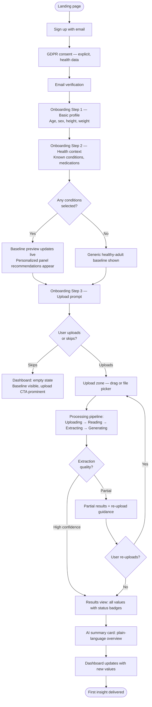
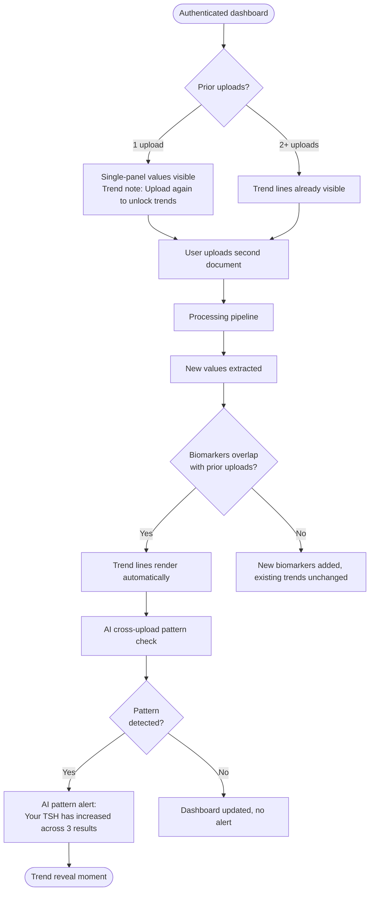
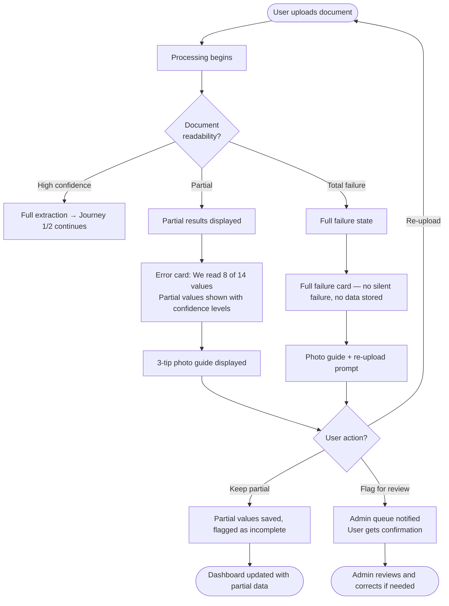
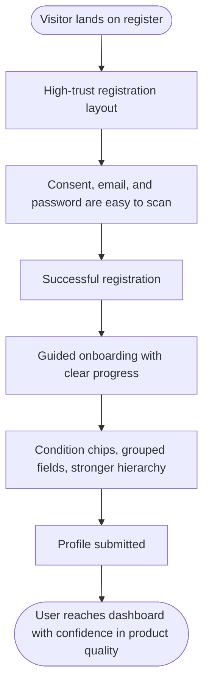

# UX Design Specification — HealthCabinet

**Author:** DUDE
**Date:** 2026-03-06

---

## Executive Summary

### Project Vision

HealthCabinet transforms scattered, uninterpreted medical lab results into a unified personal health intelligence platform. Users receive raw numbers from labs with no context, no history, and no guidance. HealthCabinet becomes the single place where all health documents live — organized beautifully — with an AI Personal Doctor that interprets them against the user's full history, profile, and risk factors.

Web-first React SPA, Ukraine MVP → EU expansion. Solo founder. Aesthetic direction: Bloomberg/Stripe precision — professional intelligence, not pastel patient UI. The MVP should feel complete and valuable on its own; billing and monetization flows are intentionally deferred until after the core product loop is validated.

### Target Users

**Sofia — Chronic Condition Manager (Primary)**
Manages Hashimoto's thyroiditis (or similar chronic condition). Tests every 3 months, gets PDFs she barely reads. Her doctor says "let's monitor" every visit. She has no idea if she's getting better or worse. She needs trend intelligence across time, not individual snapshots.

**Maks — Proactive Self-Tester (Secondary)**
Healthy, late-20s, gets a private panel twice a year. Receives lab flags he doesn't understand. Twenty minutes of googling leaves him more confused. He needs instant plain-language interpretation that informs without alarming.

**Admin — Solo Founder (Operational)**
Manages a small but growing platform: monitoring upload success rates, correcting extraction errors, handling support requests. Needs a lean operational dashboard that surfaces what matters without ceremony.

### Key Design Challenges

1. **Trust with sensitive data** — users are surrendering their most personal data to an unfamiliar platform. Every screen must signal safety and transparency. Trust is built incrementally and lost instantly.

2. **Cold-start empty state** — most health apps are useless until you've accumulated history. The personalized baseline generated from onboarding profile alone — before any upload — is a critical differentiator and must feel genuinely valuable, not placeholder content.

3. **Upload error recovery** — the graceful failure path (blurry photo, partial extraction) must feel helpful rather than broken. Users who give up at this point are permanently lost; the recovery UX must guide, not frustrate.

4. **AI output tone and framing** — the AI must feel authoritative enough to be trusted but never diagnostic. The language and visual framing of AI output requires surgical precision: informative, calm, actionable, never alarming or clinically overconfident.

5. **Complete MVP without monetization clutter** — the first release must feel coherent and high-trust without upgrade prompts, paywalls, or billing interruptions.

### Design Opportunities

1. **The trend reveal moment** — when a user sees their first multi-upload trend line (Sofia's TSH climbing across three quarters), that is the product's emotional peak. Designing this reveal deliberately — pacing, visual weight, AI annotation — is the highest-leverage UX investment in the product.

2. **Onboarding as value delivery** — the medical profile setup can generate visible, personalized output immediately (baseline recommendations, relevant panel suggestions). Treating onboarding as the product's first value moment — not a prerequisite form — reframes the entire first-run experience.

3. **Professional aesthetic as trust signal** — the Bloomberg/Stripe aesthetic direction is simultaneously a design choice and a credibility mechanism. Precision and restraint communicate medical seriousness in a way cheerful health-app aesthetics cannot.

---

## Core User Experience

### Defining Experience

The core loop is: **upload → understand → trust the platform more**. The ONE thing users do most frequently is upload a health document and receive meaning from it — not just data extraction but genuine interpretation. Every subsequent use deepens this loop and compounds the product's value. The defining interaction is the moment a raw lab result becomes something a user actually understands.

### Platform Strategy

Web-first SPA, desktop-optimized with full responsiveness down to 375px (iPhone SE). Primary interaction contexts:

- **Desktop**: Drag-and-drop upload, keyboard navigation, wide-screen dashboard with trend visualization
- **Mobile browser**: Touch-friendly upload targets for users photographing paper lab printouts; responsive dashboard for on-the-go result checking

Camera access is an optional enhancement for MVP (not required). No offline functionality needed. Full keyboard navigation required for all core flows. Browser support: Chrome, Firefox, Safari, Edge (last 2 versions each).

### Effortless Interactions

These interactions must require zero friction or thought:

- **Document upload** — single drag-and-drop or tap; accepts image/* and PDF; no format selection, no pre-processing required from user
- **Reading interpretation** — scannable plain-language output; no medical jargon requiring decoding; organized so the most important information is immediately visible
- **Understanding current status** — color-coded value context (color + text label, never color alone) readable at a glance without needing to read detail
- **Processing awareness** — real-time status updates (uploading → reading → extracting → generating insights); users never wonder "did it work?"
- **Onboarding** — profile setup generates visible personalized output immediately; completing the form feels like value delivery, not prerequisite admin

### Critical Success Moments

| Moment | Target | Stakes |
|---|---|---|
| Onboarding baseline generation | Profile complete → personalized baseline appears immediately | First impression; sets expectation that the product is smart from day one |
| First upload → first insight | <60 seconds from upload to AI summary | If this delivers, the user is retained; if it fails, they likely never return |
| First trend line (2nd+ upload) | Trend line renders automatically after second upload | The "Sofia moment" — seeing your own health pattern over time; primary driver of emotional investment and retention |
| Upload failure recovery | Partial extraction → clear guidance → successful re-upload | Users who give up here are permanently lost; recovery UX must guide, not frustrate |

### Experience Principles

1. **Meaning over data** — never show a raw number without context. Every value has a color, a label, and plain-language framing. Data without meaning is noise.

2. **Trust is earned incrementally** — every screen reinforces: you own your data, we handle it with care. Consent is visible, not buried. No dark patterns, ever. Trust is built slowly and lost instantly.

3. **Silence is failure** — every process state must be communicated. Users should never wonder "did it work?" Processing steps, success confirmations, and graceful errors are all first-class UI, not afterthoughts.

4. **Intelligence compounds** — the product gets measurably better with each upload. Design must make this accumulation *visible* — trend lines, cross-upload patterns, AI memory. The more you use it, the smarter it gets for you.

5. **Professional restraint** — precision and calm over cheerfulness. No gamification, no achievement badges, no streaks. The product earns loyalty through genuine intelligence only.

---

## Desired Emotional Response

### Primary Emotional Goals

**Primary: Informed calm.**

Not excitement. Not delight. *Calm with agency.* The product succeeds when users leave each session feeling like they understand their own body — not alarmed, not overwhelmed, just: *I know what's going on, and I know what to do next.* Sofia has been anxious about her numbers for years. Maks was confused and scared by a lab flag. HealthCabinet resolves that anxiety through clarity, not reassurance.

### Emotional Journey Mapping

| Stage | Target feeling | Avoid |
|---|---|---|
| First discovery / landing | Credible, serious, trustworthy | Hyped, cluttered, "app-y" |
| Onboarding (profile setup) | Seen and understood | Interrogated, clinical |
| First upload processing | Anticipation with confidence | Anxiety about whether it worked |
| First insight received | Clarity — "now I get it" | Overwhelm, alarm, confusion |
| First trend line | Recognition — "I can see my own pattern" | Indifference, underwhelm |
| Error / partial extraction | Guided, not embarrassed | Broken, frustrated, abandoned |
| Returning user | Routine ownership | Chore-like obligation |
| Upgrade moment | Natural next step | Manipulated, pressured |

### Micro-Emotions

- **Confidence over confusion** — users should never feel stupid for not understanding a value; the product interprets, not just displays
- **Trust over skepticism** — every data handling decision must be visible enough to pre-empt doubt
- **Informed over alarmed** — even bad results must be framed in a way that motivates action, not panic
- **Ownership over dependency** — users should feel more capable with the product, not more reliant on it
- **Satisfaction over delight** — this isn't a product that should produce excitement; it should produce quiet, reliable competence

### Design Implications

| Emotion target | UX design approach |
|---|---|
| Informed calm | Muted color palette; white space; no urgent reds unless clinically warranted; AI tone calibrated to "knowledgeable friend" not "alarm system" |
| Trust | Visible data ownership controls; consent flows that don't hide; "you own your data" as recurring but never pushy signal |
| Confidence | Value context always paired with plain-language explanation; no orphaned numbers; AI output always explains *why* |
| Ownership | Profile and history always accessible; user can flag, correct, and delete; no lock-in feeling |
| Guided on failure | Upload errors come with specific, actionable recovery steps; partial results shown, not hidden |

### Emotional Design Principles

1. **Calm is the brand** — every micro-interaction, color choice, copy line, and animation should reduce anxiety, not amplify it. If a design decision creates urgency unnecessarily, it's wrong for this product.

2. **Empowerment, not dependency** — the product makes users more capable, not more reliant. Users leave each session knowing more than when they arrived.

3. **Never make a user feel stupid** — lab results are confusing by design; the product absorbs that complexity entirely so users never have to.

4. **Earn trust through transparency** — don't tell users you're trustworthy; show them with visible consent controls, data ownership language, and honest AI framing.

---

## UX Pattern Analysis & Inspiration

### Inspiring Products Analysis

**Bloomberg Terminal / Bloomberg.com**
Dense information presented with absolute precision. Data has hierarchy — you always know what matters most. Color is functional, not decorative. Nothing is soft or friendly; everything is purposeful.
*UX lesson:* Information density without clutter. Numbers are primary; context is secondary; decoration is absent. The aesthetic communicates authority before you read a single word.

**Stripe Dashboard**
Complex technical data made scannable and beautiful. Clean typography, restrained palette, generous white space. Status indicators are clear without being alarming. Empty states tell a story and guide next action.
*UX lesson:* Empty states as guidance, not voids. Status badges used sparingly and meaningfully. The dashboard feels like a command center, not a report.

**Linear (Project Management)**
Speed and keyboard-first interaction. Actions feel instant. Hierarchy is clear. No superfluous UI chrome. A power tool that doesn't feel intimidating.
*UX lesson:* Processing states should feel fast even when they aren't. UI should get out of the way of content.

**Headspace / Calm (emotional tone reference only, not aesthetic)**
Manages anxiety-adjacent subject matter through calm, measured design. Copy is never alarming. Transitions are gentle. Nothing rushes the user.
*UX lesson:* The emotional register — how copy is written, how transitions feel — applied specifically to AI output and error messages.

### Transferable UX Patterns

**Navigation Patterns:**
- Left sidebar with icon + label nav (Stripe, Linear) — persistent navigation for main sections (Dashboard, Documents, Profile, Settings); collapses to bottom nav on mobile
- Contextual detail panels (Bloomberg) — clicking a biomarker opens a focused detail view without leaving the dashboard; no full page reloads

**Interaction Patterns:**
- Drag-and-drop upload with inline progress (Dropbox, Google Drive) — file lands, progress bar animates immediately, status updates in real time; the wait feels active, not passive
- Step-by-step processing status (Stripe payment flows) — "uploading → reading → extracting → generating insights" as visible pipeline stages, not a spinner
- Inline value flagging (GitHub inline comments) — flag button appears on hover next to any extracted value; no modal required

**Visual Patterns:**
- Color-coded status badges with text label (Stripe, Linear) — color paired with "Optimal" / "Borderline" / "Concerning" / "Action needed"; color never used alone
- Trend sparklines in data tables (Bloomberg, financial dashboards) — small inline charts next to each biomarker showing direction at a glance
- Card-based document cabinet (Notion, Google Drive) — each uploaded document as a card with thumbnail, date, and extraction status

### Anti-Patterns to Avoid

- **Gamification elements** (streaks, badges, points) — explicitly excluded; undermines the professional trust signal
- **Pastel health-app aesthetic** — signals toy, not tool; erodes credibility for handling sensitive medical data
- **Aggressive upgrade prompts** — paywalls mid-flow, modal interruptions, urgency timers; incompatible with trust-first positioning
- **Silent processing** — a spinner with no status during a 45-60 second extraction creates abandonment anxiety; every stage must be named
- **Isolated numbers** — showing a raw lab value without immediate context replicates the exact problem HealthCabinet exists to solve
- **Overwhelming onboarding forms** — multi-page medical intake that feels like paperwork rather than a product's first value delivery

### Design Inspiration Strategy

**Adopt directly:**
- Stripe's dashboard aesthetic: clean, restrained, functional color
- Linear's processing speed feel: instant feedback, no waiting without information
- Bloomberg's information hierarchy: what matters most is largest and most prominent

**Adapt for HealthCabinet:**
- Bloomberg density → soften slightly for a B2C audience; less terminal, more precision tool
- Stripe's status badges → adapt palette for health context (avoid pure traffic-light red for non-critical values)
- Calm's copy tone → apply specifically to AI output and error messages, not the full UI

**Avoid entirely:**
- Pastel consumer health aesthetic
- Gamification of any kind
- Freemium pressure patterns

---

## Design System Foundation

### Design System Choice

**shadcn/ui + Tailwind CSS**

### Rationale for Selection

- **shadcn/ui** provides copy-paste, fully owned components built on Radix UI primitives — accessibility (keyboard navigation, ARIA, WCAG AA) solid by default; no library lock-in since all components live in the codebase
- **Tailwind CSS** is the natural fit for the Bloomberg/Stripe precision aesthetic — tight spacing, exact color control, no framework opinions fighting the design direction
- **Solo founder fit** — fast development velocity, zero version-upgrade pain, components grow and modify without workarounds
- **Ecosystem alignment** — Recharts or Tremor for charts (both Tailwind-native), React Hook Form for medical profile, all composable without conflict

### Implementation Approach

**Phase 1 — Design tokens first:**
- Color palette: dark neutral base, minimal accent, 4 semantic health status colors (Optimal / Borderline / Concerning / Action Needed) — specific hex values defined, never default Tailwind red/green
- Typography: Inter (or equivalent), strong size hierarchy, consistent weight usage
- Spacing: 4px base grid, tight and consistent throughout

**Phase 2 — Base component layer (shadcn/ui defaults + theme):**
- Button, Input, Select, Badge, Card, Dialog, Toast — all themed to design tokens
- Table, Tabs, Separator — for dashboard and document cabinet layouts

**Phase 3 — Custom domain components:**
- Biomarker value card (status badge + sparkline + plain-language note)
- Upload zone with real-time processing pipeline status display
- Trend line chart panel (biomarker over time, multi-upload)
- AI interpretation block (distinct visual container for AI output + disclaimer)
- Processing status pipeline (uploading → reading → extracting → generating insights)

### Customization Strategy

- Health status colors defined as semantic tokens, not tied to Tailwind defaults — allows precise clinical calibration separate from UI state colors
- AI output blocks have distinct visual treatment (background tint, left border accent) to visually separate AI interpretation from raw data
- Color never used as the sole status indicator — every color-coded element includes a text label (WCAG AA compliance, color blindness safety)
- Component variants should prioritize clarity of state, confidence, and progression rather than monetization gating

---

## Visual Design Foundation

### Color System

Dark-neutral precision palette — no existing brand guidelines; derived from Bloomberg/Stripe direction and "informed calm" emotional goal.

**Base palette:**

| Token | Hex | Usage |
|---|---|---|
| `surface-base` | `#0F1117` | App background |
| `surface-card` | `#1A1D27` | Cards, panels, dashboard sections |
| `surface-elevated` | `#22263A` | Hover states, modals, dropdowns |
| `border-subtle` | `#2E3247` | Dividers, card borders |
| `text-primary` | `#F0F2F8` | Primary headings and values |
| `text-secondary` | `#8B92A8` | Labels, metadata, secondary copy |
| `text-muted` | `#4E5568` | Placeholders, disabled states |
| `accent` | `#4F6EF7` | Primary actions, links, active states |

**Health status tokens (semantic — never pure traffic-light):**

| Token | Hex | Label | Meaning |
|---|---|---|---|
| `status-optimal` | `#2DD4A0` | Optimal | Value within ideal range |
| `status-borderline` | `#F5C842` | Borderline | Worth monitoring |
| `status-concerning` | `#F08430` | Concerning | Outside normal range |
| `status-action` | `#E05252` | Action needed | Significantly out of range |

Orange (not red) for "concerning" reduces alarm for out-of-range values that are not clinically dangerous. Tokens are distinct from Tailwind defaults to avoid semantic collisions.

### Typography System

**Primary font:** Inter (variable), system-fallback `ui-sans-serif`

Rationale: professional, readable at small sizes, dominant in data-heavy precision UIs (Linear, Vercel, Stripe), free and well-maintained.

**Type scale:**

| Level | Size | Weight | Usage |
|---|---|---|---|
| `display` | 32px / 2rem | 700 | Dashboard section titles, onboarding headers |
| `h1` | 24px / 1.5rem | 600 | Page titles |
| `h2` | 20px / 1.25rem | 600 | Section headers, card titles |
| `h3` | 16px / 1rem | 600 | Sub-section labels |
| `body` | 15px / 0.9375rem | 400 | Primary content, AI interpretation text |
| `label` | 13px / 0.8125rem | 500 | Metadata, value labels, status text |
| `micro` | 11px / 0.6875rem | 400 | Reference ranges, disclaimers |

Biomarker values displayed at 24px / 700 — values are primary information, immediately readable without being oversized.

### Spacing & Layout Foundation

**Base unit:** 4px — scale: 4, 8, 12, 16, 24, 32, 48, 64px

**Layout:**
- Main app: left sidebar (240px fixed) + content area
- Content max-width: 1280px, centered on wide screens
- Dashboard grid: 12-column, 24px gutter
- Card internal padding: 20px
- Mobile: sidebar collapses to bottom nav (4 icons); content full-width with 16px horizontal padding

**Density:** Moderate-tight — data-rich without feeling cramped. More Bloomberg than Notion; more Linear than Figma.

### Accessibility Considerations

- All text on `surface-card` meets WCAG AA contrast (4.5:1 minimum); `text-primary` on `surface-card` ≈ 11:1
- Health status colors always paired with text label — never color-only
- `status-optimal` green chosen for color-blind safety (deuteranopia-aware: distinct from warning orange when desaturated)
- Focus rings visible on all interactive elements (2px `accent` outline, 2px offset)
- Font sizes never below 11px; `micro` text used only for supplementary info, not essential content
- All form inputs minimum 44px touch target height

---

## Design Direction Decision

### Design Directions Explored

Six interactive directions were generated and explored via HTML showcase (`ux-design-directions.html`), each demonstrating a different screen or state using the established visual foundation:

| # | Direction | Screen demonstrated |
|---|---|---|
| 1 | Dashboard Precision | Main dashboard — biomarker table, sparklines, sidebar nav |
| 2 | Upload Flow | Document-centric view with live processing pipeline status |
| 3 | Onboarding | Profile step with condition chips + live baseline preview |
| 4 | AI Results | Full interpretation view: value cards, AI block, trend charts, follow-up actions |
| 5 | Empty State | First-run experience with blurred preview and 3-step guide |
| 6 | Error Recovery | Partial extraction state with confidence levels and photo tips |

### Chosen Direction

**Unified design system across all screens** — the six directions are not competing aesthetics but complementary views of the same product. All use the established dark-neutral precision palette, Inter typography, and health status token system. The chosen direction commits to this unified approach across all application states.

### Design Rationale

- The dark-neutral palette with functional color creates the Bloomberg/Stripe precision feel without being austere — warm enough for a health context, professional enough to signal credibility
- Left sidebar navigation (Direction 1) establishes spatial orientation for a data-rich app used repeatedly
- The processing pipeline pattern (Direction 2) solves the anxiety of the 45-60 second wait without a spinner
- The baseline preview on onboarding (Direction 3) delivers the cold-start value moment within the profile form itself
- The AI block with left accent border (Direction 4) visually separates AI interpretation from raw data at a glance
- Empty state with blurred chart preview (Direction 5) communicates what the product will become without overpromising
- Partial extraction with confidence levels (Direction 6) makes failure feel informative rather than broken

### Implementation Approach

- shadcn/ui components themed to design tokens across all screens
- Health status tokens applied consistently — color always paired with text label
- AI interpretation blocks as a custom component with distinct visual treatment
- Processing pipeline as a reusable multi-step status component
- Responsive breakpoints: sidebar collapses to bottom nav at <768px; value cards reflow from 2-column to single-column

---

## 2. Core User Experience

### 2.1 Defining Experience

**"Upload your lab result and finally understand what it means."**

The defining interaction in one sentence: *Upload a lab result and understand it — instantly, in plain language, with full context.* Every other product feature supports or compounds this moment. If this interaction is fast, clear, and trustworthy, the product earns its place in the user's routine.

### 2.2 User Mental Model

Users arrive with one of two mental models:

**The anxious one (Sofia):** "I have a PDF I don't understand. I've googled my values and now I'm either panicking or more confused. I just want to know: is this bad?"

**The curious one (Maks):** "I got a printout with some flags. It doesn't seem urgent but I don't know what it means."

Both expect: drag file in → magic happens → I understand my health. They've seen AI do impressive things. They expect speed and clarity. They will be surprised if the product actually delivers both.

What they hate about existing solutions:
- Googling individual values gives alarming, decontextualized results
- Lab PDFs are walls of numbers with no interpretation
- Generic health apps are empty and useless until months of use
- AI chatbots don't have their documents and don't remember their history

### 2.3 Success Criteria

- Upload completes and processing begins within 2 seconds of file drop
- Every extracted value is immediately paired with: status color + text label + 1-sentence plain-language note
- Most important/notable values are visually elevated — user doesn't have to read everything to find what matters
- Uncertain or partially extracted values are shown clearly, never hidden
- User can ask a follow-up without navigating away from results

**Success signal:** User says "oh, so *that's* what that means" — not "interesting" and not "I need to google this more."

### 2.4 Novel UX Patterns

| Element | Pattern type | Approach |
|---|---|---|
| File upload | Established (drag-and-drop) | Adopt directly; no education needed |
| Processing pipeline status | Established (step indicators) | Adopt; make stages named and meaningful, not just a spinner |
| Color-coded value status | Established (traffic light) | Adapt — 4 states, never color-only, health-calibrated palette |
| AI interpretation block | Novel | "Your personal doctor's note" — distinct visual container treatment |
| Cross-upload trend line | Established (time-series chart) | Adopt; the emotional design of the reveal is the innovation |
| Context-first baseline (pre-upload) | Novel | First-run dashboard populated from profile alone — no existing pattern to follow |

### 2.5 Experience Mechanics

**Upload-to-insight flow:**

**1. Initiation:**
- Upload zone prominent on dashboard and Documents section
- On first login post-onboarding: single clear CTA — "Upload your first lab result"
- Full-page drag zone: dropping a file anywhere on the dashboard triggers upload

**2. Interaction:**
- File drops → immediately shows filename + size + animated "received" confirmation
- Processing pipeline activates with named sequential stages: Uploading → Reading document → Extracting values → Generating insights
- Each stage labeled — never a bare spinner
- ~45–60 seconds total; progress stays visible without blocking navigation

**3. Feedback:**
- On completion: dashboard updates in place — extracted values appear with status badges
- Summary card at top: "We found 12 values in your CBC panel. Here's what stands out."
- Notable values (borderline or concerning) visually elevated first
- Each value: name + current number + status badge + 1-sentence note + reference range on expand

**4. Completion:**
- Clear success state: all values visible, AI summary present
- If 2+ uploads: trend lines render automatically
- Next action surfaced: "Ask a follow-up about these results" or "View your full dashboard"
- If partial extraction: "We read 8 of 12 values. [Re-upload with better lighting]" — partial shown, never hidden

---

## User Journey Flows

### Journey 1: First-Time User — Registration to First Insight

Entry: Landing page. Goal: onboarding complete and first AI insight delivered in under 5 minutes.

**Key optimizations:**
- Consent must feel meaningful — visible summary of what's collected and why, not a dismissal checkbox
- Baseline preview on Step 2 creates a "the product is already working" moment mid-onboarding
- Upload skip always available — dashboard never gated behind upload completion

---

### Journey 2: Returning User — Second Upload to Trend Discovery

Entry: Authenticated dashboard with 1 prior upload. Goal: trend lines visible and AI pattern surfaced.

**Key optimizations:**
- Trend lines render in-place on the dashboard — no navigation required
- Pattern insights appear directly when useful; no upgrade branch interrupts the workflow

---

### Journey 3: Upload Error Recovery

Entry: User uploads a poor-quality photo. Goal: user successfully re-uploads or retains partial data without frustration.

**Key optimizations:**
- Partial values always shown — never hidden behind a re-upload wall
- Confidence levels visible on each extracted value, not just in error state
- User flag available on any value at any time, not just in error recovery

---

### Journey 4: Registration and Onboarding Quality Baseline

Entry: New user lands on `/register` and then `/onboarding`. Goal: the first-run experience already reflects the product's intended quality before dashboard-heavy Epic 3 work begins.

**Key optimizations:**
- Registration and onboarding feel like product surfaces, not placeholder forms
- Visual polish supports trust before the user uploads sensitive health data
- No upgrade prompts, Stripe flows, or monetization branches interrupt the first-run journey

---

### Journey Patterns

**Navigation:**
- All major sections reachable from sidebar in ≤1 click; no dead-end screens
- Back navigation always available; breadcrumbs on detail views

**Decision:**
- Binary choices (keep/re-upload, continue/dismiss) always offer a non-destructive path
- Future monetization should not distort MVP interaction patterns or interrupt core health workflows

**Feedback:**
- Processing always shows named stages — never a bare spinner
- Success states are explicit: dashboard updates in-place, visible confirmation
- Error states show what *was* extracted, not just what failed

### Flow Optimization Principles

1. **Minimize steps to first value** — onboarding → upload → insight in under 5 minutes
2. **Progressive disclosure** — dashboard shows most important information first; detail on demand
3. **Non-destructive defaults** — every branch has a "continue without this" path; no mandatory actions except consent
4. **Failure is informative** — error states surface partial data and specific recovery guidance; silent failures prohibited

---

## Component Strategy

### Design System Components

shadcn/ui provides the following out of the box — no custom work required:

**Layout & Navigation:** Sidebar, Sheet (mobile drawer), Tabs, Breadcrumb, Separator
**Inputs & Forms:** Input, Select, Checkbox, RadioGroup, Label, Textarea, Switch, Form (react-hook-form integration)
**Feedback:** Toast, Alert, Badge, Progress, Skeleton
**Overlay:** Dialog, Drawer, Popover, Tooltip, DropdownMenu
**Data:** Table, Card, ScrollArea
**Actions:** Button (all variants)

### Custom Components

**1. BiomarkerValueCard**

- **Purpose:** Display a single extracted health value with full context
- **Anatomy:** Biomarker name · Current value (large, color-coded) · Unit · HealthStatusBadge · 1-sentence plain-language note · Expand toggle for reference range
- **States:** default · hovered · expanded (reference range visible) · flagged (user-flagged) · low-confidence (extraction warning)
- **Variants:** `compact` (table row) · `card` (grid tile) · `featured` (most notable value)
- **Accessibility:** `aria-label="[biomarker]: [value] [unit], status [label]"` · expand/collapse keyboard accessible
- **Content rule:** Plain-language note max 120 chars · Status text never omitted

**2. ProcessingPipeline**

- **Purpose:** Communicate document processing progress across named stages
- **Anatomy:** Stage list (Uploading · Reading document · Extracting values · Generating insights) · Per-stage status dot (done/active/pending) · Active stage time estimate
- **States:** `idle` · `uploading` · `reading` · `extracting` · `generating` · `complete` · `failed` · `partial`
- **Behavior:** Stages animate sequentially; active stage pulses; failed stage shows error inline
- **Accessibility:** `role="status"` with live region announcements on stage transitions

**3. AIInterpretationBlock**

- **Purpose:** Display AI-generated interpretation — visually distinct from raw data
- **Anatomy:** Left accent border (3px) · AI label badge · Interpretation text · Reasoning trail expand · Disclaimer line
- **States:** `loading` (skeleton) · `default` · `expanded` (reasoning trail visible)
- **Variants:** `summary` (top-of-results) · `pattern` (cross-upload observation) · `inline` (per-value)
- **Content rule:** Disclaimer always present as final line — natural language, not legal footnote

**4. TrendChart**

- **Purpose:** Visualize a single biomarker's values across multiple uploads over time
- **Anatomy:** Line chart · X-axis (dates) · Y-axis (value + unit) · Reference range band · Hover tooltip · Upload count label
- **Library:** Recharts
- **States:** `single-upload` (disabled with "Upload again to unlock" overlay) · `multi-upload` (active) · `loading`
- **Variants:** `mini` (24px sparkline in table) · `standard` (dashboard card) · `detail` (full-width panel)
- **Accessibility:** `<figure>` + `<figcaption>` describing trend direction; data table alternative on focus

**5. UploadZone**

- **Purpose:** Primary document upload interaction surface
- **Anatomy:** Dashed border container · Icon + instructional text · File info on drop · Inline error display
- **States:** `idle` · `drag-over` (accent border + background tint) · `uploading` (transitions to ProcessingPipeline) · `error`
- **Behavior:** Full-dashboard drag-zone on authenticated pages; UploadZone also always clickable
- **Accessibility:** `role="button"` · keyboard accessible (Enter/Space opens picker) · drag-over announced via live region

**6. HealthStatusBadge**

- **Purpose:** Reusable status indicator across all biomarker contexts
- **Anatomy:** Colored dot + text label, or pill with background tint
- **Variants:** `dot` (inline) · `pill` (card contexts) · `large` (featured card)
- **Values:** Optimal · Borderline · Concerning · Action needed
- **Rule:** Color never used without text label — enforced at component level

**7. PartialExtractionCard**

- **Purpose:** Surface partial extraction results with confidence levels and recovery guidance
- **Anatomy:** Warning header (N of M values read) · Extracted values with per-value confidence · Unread values list · 3-tip photo guide · Re-upload / Keep partial / Flag actions
- **States:** `partial` · `full-failure`

### Component Implementation Strategy

- All custom components built using design system tokens (no hardcoded values)
- HealthStatusBadge is a dependency of BiomarkerValueCard — built first
- ProcessingPipeline and UploadZone are tightly coupled — designed and built together

### Implementation Roadmap

**Phase 1 — MVP critical path:**
- UploadZone + ProcessingPipeline
- BiomarkerValueCard (`card` + `compact` variants)
- HealthStatusBadge (all variants)
- AIInterpretationBlock (`summary` variant)
- PartialExtractionCard

**Phase 2 — Trend intelligence:**
- TrendChart (`mini` sparkline + `standard` variants)
- BiomarkerValueCard (`featured` variant)
- AIInterpretationBlock (`pattern` variant)

**Phase 3 — Polish depth:**
- TrendChart (`detail` variant)
- AIInterpretationBlock (`inline` variant + reasoning trail)
- BiomarkerValueCard (`flagged` state)
- ProcessingPipeline (admin variant)

---

## UX Consistency Patterns

### Button Hierarchy

| Tier | Usage | Visual |
|---|---|---|
| **Primary** | One per screen; main action (Upload, Continue, Save) | Filled `accent` background, white text |
| **Secondary** | Supporting actions (Export, Cancel, Back) | Outlined, `border-subtle`, `text-secondary` |
| **Ghost** | Low-emphasis actions (View all, Dismiss) | No border, `text-secondary`, hover background only |
| **Destructive** | Delete document, Delete account | Outlined `status-action`; requires confirmation dialog |
**Rules:** Never two primary buttons on one screen. Destructive actions always require confirmation.

### Feedback Patterns

**Toast notifications** (non-blocking, top-right, auto-dismiss 4s):
- Upload started → "Processing your document…" (info)
- Upload complete → "12 values extracted from CBC Panel" (success)
- Value flagged → "Thanks — we'll review this value" (info)
- Generic error → "Something went wrong. Try again." (error, no auto-dismiss)

**Inline alerts** (persistent, contextual):
- Partial extraction → PartialExtractionCard (not a toast — requires user action)
- Low-confidence value → inline warning icon on BiomarkerValueCard
- GDPR deletion in progress → persistent info banner until complete

**Empty states** (instructional, not decorative):
- Dashboard (no uploads): blurred chart preview + 3-step guide + primary Upload CTA
- Documents (no uploads): upload zone is the full content area
- Trends (single upload): chart disabled + "Upload again to unlock trends"

**Loading states:**
- Skeleton loaders for all card-based content — never a full-page spinner
- ProcessingPipeline for document processing — named stages only
- Inline skeleton on individual value cards while insights generate

### Form Patterns

- Inline validation on blur (not on keystroke) — reduces anxiety during input
- Error message below field with color + text label — never just a red border
- Medical profile: condition chips (multi-select) preferred over dropdowns — scannable, touch-friendly
- Progress indicator always visible in onboarding (Step N of M); back always available
- GDPR consent: separate explicit checkbox for health data, plain-language summary above it, never pre-checked

### Navigation Patterns

**Sidebar (desktop):** Active = left border accent + background tint. Icons + labels always. Collapses to bottom tab bar on mobile (max 4 items).

**In-app:** Detail views use breadcrumb + back button. No nested navigation beyond 2 levels. Browser back button always works. Contextual item actions (flag, delete) appear on hover or via kebab — not as inline buttons.

**Modal and overlay:** Modals for account deletion and GDPR export only. All dialogs dismissible via Escape or outside click. Destructive confirmations require explicit user confirmation.

### AI Output Patterns

- AI content always in AIInterpretationBlock — visually separated from raw data at all times
- Disclaimer always present as last line — integrated into copy, not a separate footnote
- Uncertainty surfaced explicitly — never hidden or minimized
- AI never recommends medication changes, dosages, or treatments
- Tone: "knowledgeable friend" — confident enough to be useful, humble enough to be safe

---

## Responsive Design & Accessibility

### Responsive Strategy

**Desktop (1024px+, primary experience):**
- Full left sidebar (240px) + content area; max content width 1280px
- Dashboard: 3-column stat cards, full biomarker table with sparklines
- Results: 2-column value card grid + AI block + trend sidebar
- Data density: moderate-tight; multiple data points visible without scrolling

**Tablet (768px–1023px):**
- Sidebar collapses to icon-only (56px) with labels on hover/expand
- Dashboard: 2-column stat cards; biomarker table simplified rows
- Results: single-column value cards; AI block full-width; trend chart below
- All touch targets minimum 44×44px

**Mobile (320px–767px):**
- Sidebar replaced with bottom tab bar (4 items: Dashboard, Documents, Trends, Profile)
- Dashboard: single-column stacked cards; sparklines hidden (value + badge only)
- Upload: full-screen zone with camera access as first option, file picker as second
- Processing pipeline: condensed to single animated status line
- Value cards full-width; reference range collapsed by default

**Critical mobile use case:** Photographing a paper lab result is a primary mobile interaction. Upload zone is full-screen on mobile with camera access prioritized.

### Breakpoint Strategy

| Breakpoint | Width | Change |
|---|---|---|
| `xs` | 320px | iPhone SE minimum |
| `sm` | 480px | Large phones |
| `md` | 768px | Tablet / landscape (sidebar → icon-only) |
| `lg` | 1024px | Desktop (full sidebar) |
| `xl` | 1280px | Wide desktop (content width clamps) |
| `2xl` | 1536px | Ultra-wide (whitespace increases, layout unchanged) |

Approach: desktop-first design, mobile-first CSS (Tailwind default). No feature removal at smaller breakpoints — all features accessible on all sizes, adapted for context.

### Accessibility Strategy

**Target: WCAG 2.1 AA from MVP launch.**

| Requirement | Implementation |
|---|---|
| Color contrast (4.5:1 text) | `text-primary` on `surface-card` ≈ 11:1 |
| Color not sole indicator | HealthStatusBadge enforces color + text label at component level |
| Keyboard navigation | All interactive elements reachable via Tab/Enter/Space |
| Focus indicators | 2px `accent` outline, 2px offset on all focusable elements |
| Skip navigation | "Skip to main content" link at top of each page |
| Touch targets | 44×44px minimum in all shadcn/ui theme overrides |
| Motion | `prefers-reduced-motion` respected — animations disabled or simplified |
| Zoom | Layout functional at 200% browser zoom |

**Health-specific accessibility:**
- Health status conveyed via color + text label + plain-language note — triple redundancy
- Processing pipeline stage transitions announced via `aria-live="polite"`
- Error messages always contain specific actionable text — never just color change or "Error"
- AI output accessible to screen readers with proper `role` and `aria-live` on dynamic content

**Post-MVP (before EU launch):** Full WCAG 2.1 AA external audit; VoiceOver, NVDA, TalkBack testing; color blindness simulation (deuteranopia, protanopia, tritanopia).

### Testing Strategy

**Responsive:** Chrome DevTools during development + real device testing on iPhone SE (375px), mid-range Android (390px), iPad (768px), 13" laptop (1280px). Upload photo flow tested on real mobile device with real lab documents.

**Accessibility (MVP):** Axe browser extension automated checks on all pages; manual keyboard navigation through all 4 primary user journeys; contrast ratio verification on all new color combinations.

**Accessibility (pre-EU launch):** VoiceOver + Safari full flow; NVDA + Chrome full flow; external WCAG 2.1 AA audit.

### Implementation Guidelines

**Responsive:**
- Tailwind responsive prefixes (`md:`, `lg:`) exclusively — no raw media queries in components
- Touch event handlers alongside click handlers on all interactive elements
- Images use `srcset`; no layout shift on load

**Accessibility:**
- `<main>`, `<nav>`, `<header>`, `<aside>` landmarks on every page
- Form labels always associated with inputs — never placeholder-only labels
- Dynamic content uses `aria-live` regions (AI generating, processing completing)
- Modals use focus trap + return focus to trigger element on close
- All icon-only buttons have `aria-label`
- `alt` text on all images; decorative images use `alt=""`
