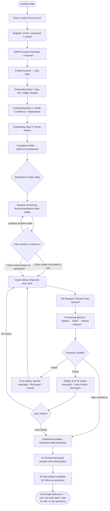
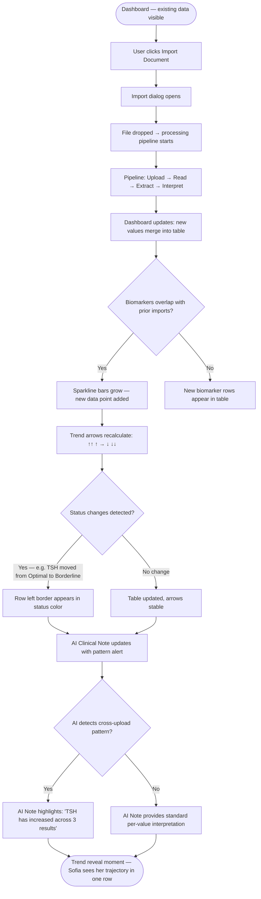
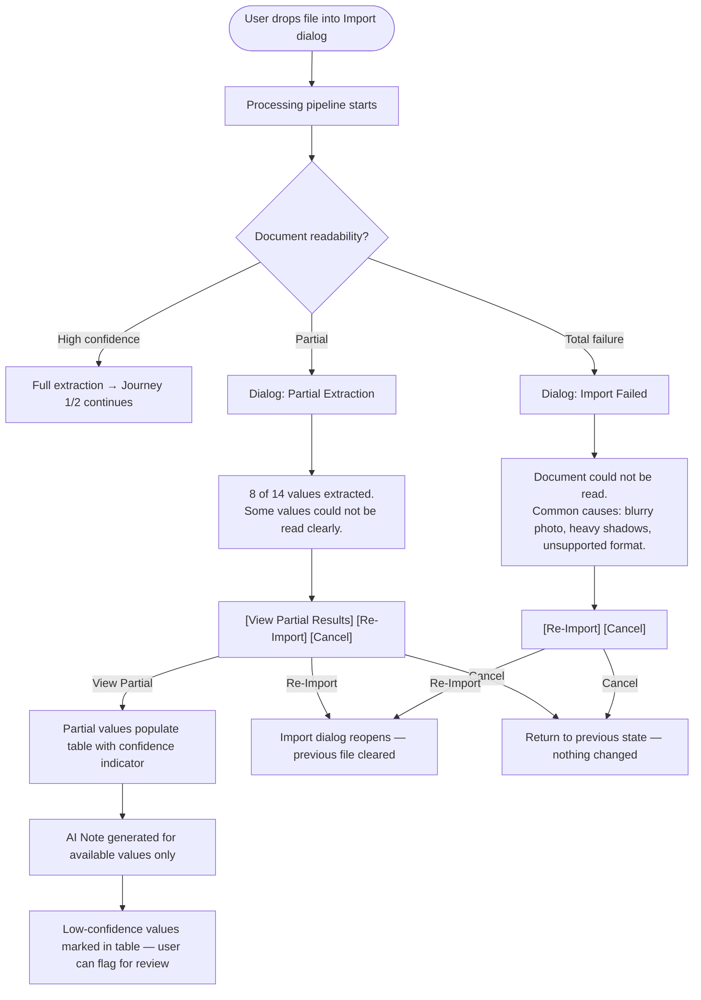
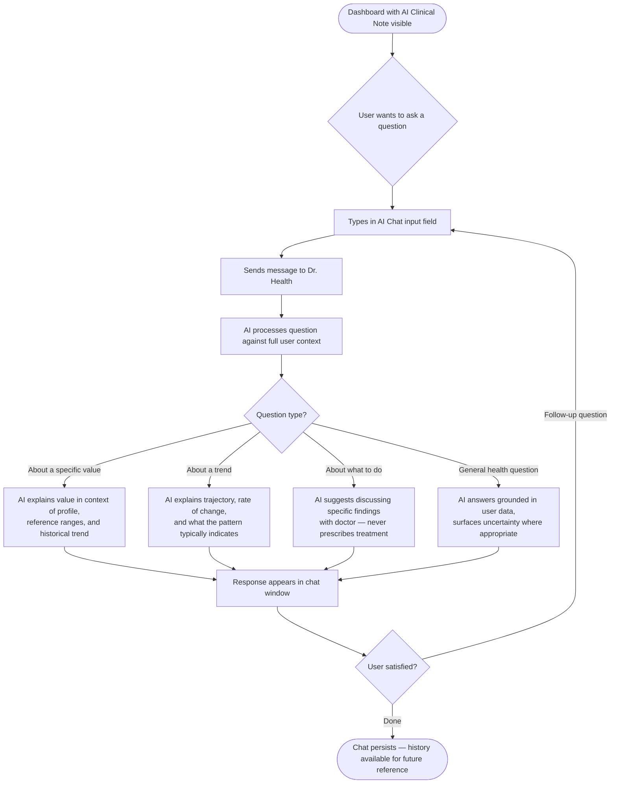
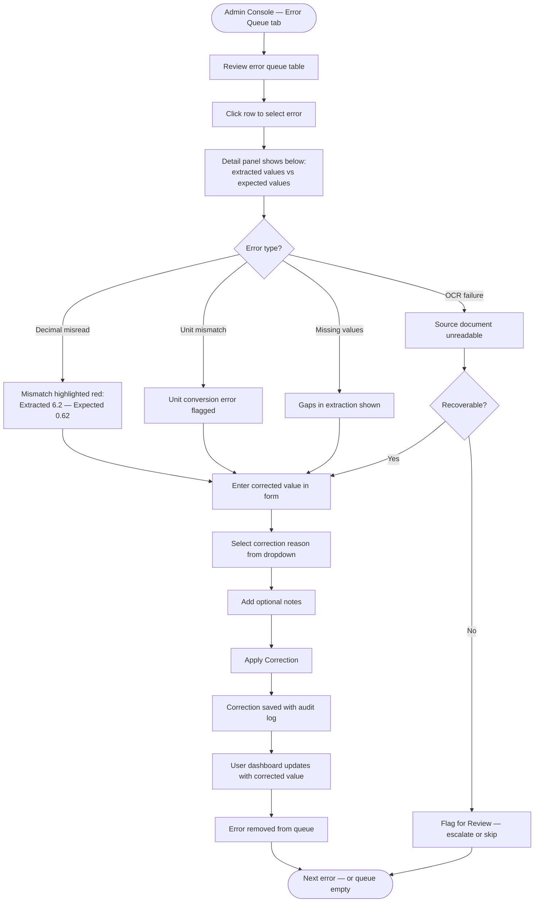

# UX Design Specification — HealthCabinet v2

**Author:** DUDE
**Date:** 2026-04-02

---

## Executive Summary

### Project Vision

HealthCabinet transforms scattered, uninterpreted medical lab results into a unified personal health intelligence platform. Users upload lab results in any format (photo or PDF, any lab, any language) and receive plain-language AI interpretation, biomarker tracking, and trend analysis. Ukraine MVP, EU expansion. Solo founder. SvelteKit 2 + Svelte 5 frontend, FastAPI backend, LangGraph AI pipeline.

alweys alignet with ux-page-mockups.html and ux-design-directions-v2.html

Five epics are shipped: authentication, document upload/processing, health dashboard with trends, AI interpretation (reasoning trails, follow-up Q&A, cross-upload patterns), and admin operations. The frontend redesign initiative addresses a cohesion and presentation gap — the functionality is solid but the interface does not yet match the product's ambition.

### Target Users

**Sofia — Chronic Condition Manager (Primary)**
Manages Hashimoto's thyroiditis. Tests every 3 months, gets PDFs she barely reads. Needs trend intelligence across time, not individual snapshots. Her defining moment: seeing TSH climbing across three quarters.

**Maks — Proactive Self-Tester (Secondary)**
Healthy, late-20s, gets private lab panels. Receives flags he doesn't understand. Needs instant plain-language interpretation that informs without alarming.

**Admin — Solo Founder (Operational)**
Monitoring upload success rates, correcting extraction errors, managing users. Needs a focused operations console.

### Key Design Challenges

1. **Missing navigation fundamentals** — the app currently lacks a proper navbar, bottom bar, and visible login/logout controls. Basic wayfinding must be solved before any page-level redesign.

2. **Dashboard needs table-driven density** — the current dashboard layout is visually weak and unconvincing. The redesign must prioritize structured tables over card layouts, presenting biomarker data in scannable rows with status indicators.

3. **Onboarding is unclear** — the current onboarding flow is not well understood by users. Steps, purpose, and progress need to be made obvious.

4. **Cohesion across surfaces** — public, auth, user app, and admin still feel like separate products. The redesign must unify them under one visual language.

5. **Mobile adaptation of a desktop-native aesthetic** — the Windows 98 / clinical medical software visual language is inherently desktop-oriented. Mobile must retain the clinical color palette and UI chrome (visible borders, labeled buttons, high contrast) while adapting layout for touch. Think modern medical device touchscreens — still clinical, still gray, but designed for fingers.

### Design Opportunities

1. **Windows 98 / clinical medical software aesthetic** — a radical and distinctive direction. Medical software worldwide still uses the Windows-era visual language: gray surfaces, beveled buttons, sunken panels, dense toolbars, status bars, tree views, table-heavy layouts. This is not nostalgia — it is the visual language that medical professionals and health-conscious users associate with serious, reliable clinical tools. HealthCabinet adopting this aesthetic signals "this is real medical software" in a market full of pastel wellness apps. No competitor in the consumer health space uses this visual identity — it is an instant differentiation moat.

2. **Table-first data presentation** — biomarker data presented in dense, sortable tables with inline status indicators, reference ranges, and sparklines. The Windows 98 ListView/DataGrid pattern is a natural fit: sortable columns, alternating row colors, inline status indicators, resizable headers.

3. **Accessibility as a natural win** — Windows 98 UI patterns have strong built-in accessibility: high-contrast borders, visible focus states, labeled everything, no hover-dependent interactions. Gray surfaces with dark text approach WCAG AAA territory without effort.

4. **Intelligence compounding made visible** — trend lines, cross-upload patterns, and AI memory depth visualized so users see the product getting smarter with each upload.

5. **Admin as clinical workstation** — the admin surface designed as a proper medical software workstation with toolbars, queue panels, and correction interfaces that feel like professional clinical tools.

6. **Competitive differentiation through aesthetic** — every consumer health app uses the same rounded-corners, soft-gradient, card-based playbook. HealthCabinet showing up looking like a clinical workstation reframes the product from "another health app" to "actual medical software." This triggers an unconscious trust shortcut no amount of modern UI polish can replicate.

---

## Core User Experience

### Defining Experience

The core loop is: **import → understand → trust the platform more**. The ONE thing users do most frequently is import a health document and receive structured, interpreted results in a dense clinical table. Every subsequent import deepens the trend data, strengthens the AI's cross-upload pattern detection, and compounds the product's intelligence. The defining interaction is the moment a wall of raw lab numbers becomes a sortable, status-coded, trend-tracked table with AI commentary — like the software at a real medical clinic, but the patient finally gets to see it too.

### Platform Strategy

Web-first SPA. **Desktop-only for MVP** (1024px+). The Windows 98 / clinical software aesthetic is inherently desktop-native. Mobile and tablet support are deferred to post-MVP.

**Desktop (1024px+):** Full Windows 98 treatment — menu bar, toolbar, beveled panels, sunken data regions, status bar, dense sortable tables, resizable window-style panels.

**Post-MVP — Mobile (<768px):** Clinical touchscreen mode — same gray palette, visible borders, high-contrast text, but simplified to stacked record rows with a bottom toolbar. No beveled 3D effects (they don't render well at small sizes). Upload prioritizes camera access with the retro chrome dialog styling.

**Navigation model:** Classic menu bar (File, View, Records, Tools, Help) + icon toolbar below it. Desktop gets the full menu system. Post-MVP mobile collapses to a hamburger menu + bottom toolbar with 5 core actions.

### Effortless Interactions

These must require zero friction:

- **Import Document** — drag-and-drop into a retro-styled dialog window, or click "Browse Files..." button. Accepts image/* and PDF. No format selection, no pre-processing.
- **Scan results table** — all values visible in one dense table with inline status indicators, reference ranges, and trend arrows. No clicking required to see the basics. Column sorting available.
- **Processing awareness** — the import dialog shows a classic Windows progress bar with named pipeline stages (Uploading → Reading → Extracting → Generating). Users never wonder "did it work?"
- **AI interpretation** — appears in a sunken panel below the results table. Reads like a clinical note, not a chatbot response. Disclaimer integrated naturally.
- **Sign out** — always visible in the File menu. Never hidden.

### Critical Success Moments

| Moment | Target | Stakes |
|---|---|---|
| First import → first table | <60 seconds from file drop to populated results table | If the table populates with accurate, status-coded values, the user trusts the product immediately |
| First trend arrow | Trend column shows directional arrows after 2nd import | The "Sofia moment" — seeing ↑↑ next to TSH across three results |
| AI pattern alert | AI interpretation panel flags a multi-upload pattern | "Your ferritin has declined steadily" — the product catches what no single doctor visit could |
| Onboarding baseline | Profile complete → baseline recommendations table appears | First impression of the clinical interface populated with personalized data |
| Upload failure recovery | Partial extraction → clear dialog with extracted values + re-import guidance | Classic Windows error dialog style: specific, actionable, not alarming |

### Experience Principles

1. **Tool, not toy** — every pixel signals "this is medical software." No rounded corners, no gradients, no playful illustrations. Beveled borders, sunken panels, gray surfaces, status bars. The aesthetic communicates authority before the user reads a single word.

2. **Density over whitespace** — show more data, not less. Tables over cards. Inline indicators over expandable panels. The user should see their full health picture without scrolling through card grids. This is a clinical workstation, not a magazine.

3. **Visible everything** — buttons look like buttons. Menus are labeled. Status bars show state. No hidden navigation, no hover-dependent interactions, no mystery icons. Windows 98 UI succeeded because nothing was ambiguous.

4. **Clinical language** — "Import Document" not "Upload your lab result." "View Record" not "See your results." "Export Data" not "Download your stuff." The vocabulary matches the aesthetic: professional, precise, medical.

5. **Intelligence compounds visibly** — trend arrows in the table, pattern alerts in the AI panel, document count in the status bar. Every import makes the data denser and the patterns clearer. The product visibly gets smarter.

---

## Desired Emotional Response

### Primary Emotional Goals

**Primary: Empowered competence.**

Not calm. Not delight. *Competence with agency.* The product succeeds when users feel like they're operating a serious medical tool — one that respects their intelligence and gives them all the data they need to act. Sofia has been a passive recipient of "let's monitor" for four years. HealthCabinet hands her the workstation and says: "Here is everything. You are capable of understanding this."

**Secondary: Novelty with substance.**

The Windows 98 aesthetic creates an immediate reaction — "wait, what is this?" That surprise earns attention. But the novelty only converts to trust if the data behind the retro chrome is genuinely good. The aesthetic opens the door; the intelligence keeps them inside.

### Emotional Journey Mapping

| Stage | Target feeling | Avoid |
|---|---|---|
| First discovery / landing | "This is different. This looks serious." | Generic, forgettable, "another health app" |
| Registration | "This is straightforward. No nonsense." | Interrogated, overwhelmed by forms |
| Onboarding (profile setup) | "The system is configuring itself for me" | Pointless data entry, unclear purpose |
| First import processing | Anticipation — progress bar moving, stages named | Anxiety, "did it break?", silent waiting |
| First results table | "I can actually read my own lab results" — competence | Overwhelm, confusion, "what do these numbers mean?" |
| First trend arrow | "I can see my own pattern" — recognition, ownership | Indifference, "so what?" |
| AI interpretation | "This is what a good doctor would explain" — trust | Alarm, clinical overconfidence, vagueness |
| Error / partial extraction | "Okay, it told me exactly what happened" — no drama | Broken, embarrassed, abandoned |
| Returning user | Routine mastery — "let me check my workstation" | Chore, obligation |
| Telling a friend | "You have to see this thing — it looks like hospital software but it actually shows you your trends" | Nothing memorable to say |

### Micro-Emotions

- **Competence over confusion** — users should feel smarter after using the product, never stupid for not understanding a value. The table format with inline status and reference ranges does the interpreting.
- **Control over dependency** — this is a tool the user operates, not a service that operates on them. Menus, toolbars, sortable columns — the user drives.
- **Trust over skepticism** — the clinical aesthetic pre-loads trust. The visible data, the straightforward error dialogs, the status bar showing system state — nothing is hidden.
- **Recognition over alarm** — even bad results are presented as data in a table row, not as red flashing warnings. A "◆ Concerning" status badge in a table cell is informative; a full-screen red alert is panic-inducing.
- **Charm over boredom** — the retro aesthetic creates genuine affection. Users *enjoy* the interface. It has personality that modern SaaS UI completely lacks.

### Design Implications

| Emotion target | UX design approach |
|---|---|
| Empowered competence | Dense tables with all data visible; no progressive disclosure hiding information; sortable columns; user controls the view |
| Straightforward errors | Classic Windows error dialog pattern: icon + specific message + actionable buttons. "Document partially read. 8 of 14 values extracted. [View Partial Results] [Re-Import]" |
| Novelty with substance | The retro chrome is the hook — beveled panels, menu bar, status bar. But the table data, trend arrows, and AI notes must be genuinely excellent or the charm becomes a gimmick |
| Trust through visibility | Status bar always shows: connection state, document count, last import date. Menu bar always accessible. No hidden state, no mystery. |
| Recognition over alarm | Health status uses table-inline badges (● Optimal, ⚠ Borderline, ◆ Concerning, ▲ Action) — color + symbol + text, always in a row context, never isolated |
| Charm and personality | Window title bars, beveled toolbar buttons, classic progress bars, "Ready" in the status bar — these micro-details create affection without compromising function |

### Emotional Design Principles

1. **Respect the user's intelligence** — show all the data. Don't simplify, don't hide, don't "protect" users from their own lab results. Present information in a structured, readable format and let them engage at their level. The tool respects you; you respect the tool.

2. **Straightforward, always** — errors are specific. Dialogs say what happened and what to do. No apologetic copy ("Oops! Something went wrong"), no vague messaging. Classic Windows error dialog energy: factual, actionable, zero drama.

3. **Earn charm, don't force it** — the retro aesthetic should feel like discovering a well-made tool, not like a gimmick. The beveled borders and menu bars create warmth *because they're functional*, not because they're ironic. If any retro element gets in the way of usability, it goes.

4. **Never make health data scary** — even the "Action needed" status is a table cell with a symbol, not a blaring alarm. The clinical workstation aesthetic inherently de-escalates medical anxiety by presenting everything as structured data rather than emotional content.

5. **Memorability is a feature** — users should be able to describe this product to a friend in one sentence: "It looks like Windows 98 hospital software but it actually explains your lab results and shows your trends." That sentence is the product's word-of-mouth engine.

---

## UX Pattern Analysis & Inspiration

### Inspiring Products Analysis

**Windows 98 / Classic Microsoft Applications (Outlook, Explorer, Excel)**
The foundational inspiration. Dense information presented with absolute clarity through established UI conventions: menu bars, toolbars, status bars, tree views, list views with sortable columns. Every element is visible and labeled. Interactive elements have physical affordance (beveled buttons, sunken fields). The user never guesses what's clickable or what state the application is in.
*UX lesson:* UI chrome is not overhead — it is communication. Menu bars, toolbars, and status bars are information channels that modern flat UI eliminated at the cost of discoverability.

**Classic Microsoft Outlook (pre-2007)**
The closest structural analogue to HealthCabinet's information architecture. Three-panel layout: folder tree (navigation) + item list (dense sortable table) + preview pane (detail/interpretation). Toolbar for frequent actions. Status bar for counts and state. Users managed hundreds of items efficiently because the interface was designed for density, scanning, and keyboard operation.
*UX lesson:* The three-panel layout — navigation tree, dense list, detail pane — is the exact pattern for HealthCabinet's dashboard: sidebar navigation, biomarker results table, AI interpretation panel.

**Clinical Laboratory Information Systems (LIS)**
Medical laboratory software that technicians and clinicians use daily. Gray interfaces, dense data grids, toolbar-heavy workflows, patient summary headers, result tables with reference ranges and flags. These systems prioritize data accuracy and scanability over aesthetics. They look dated — and that datedness signals reliability to medical professionals.
*UX lesson:* The "patient summary bar" pattern — a compact header showing name, age, sex, conditions, last visit — is directly transferable as HealthCabinet's user summary panel. Health status flags inline with result rows is the standard clinical pattern.

**Windows Explorer / File Manager**
Tree view navigation, detail list view with sortable columns, status bar showing item counts and selection state. The document cabinet in HealthCabinet maps directly to this pattern: a list of health documents with metadata columns (date, type, status, value count), sortable and filterable.
*UX lesson:* The document cabinet should feel like browsing files in Explorer — list view with columns, not a card grid.

### Transferable UX Patterns

**Navigation Patterns:**

- Menu bar (File, View, Records, Tools, Help) — persistent top-level navigation for all actions; provides discoverability without cluttering the workspace
- Toolbar with labeled icon buttons — frequent actions (Import, Export, Refresh, View Trends) one click away
- Left panel navigation / folder tree — section switching (Dashboard, Documents, Profile, Settings) with visual active state

**Data Patterns:**

- Sortable column list view (Outlook inbox / Explorer detail view) — biomarker table with columns for name, value, unit, status, reference range, trend; click column headers to sort
- Alternating row colors — subtle gray/white alternation for scanability in dense tables
- Patient summary header bar — compact fixed panel showing user identity, conditions, document count, last import date
- Inline status indicators — ● ⚠ ◆ ▲ symbols with text labels directly in table cells, not as separate badges or cards

**Interaction Patterns:**

- Classic dialog windows — import, export, delete confirmation, error messages all presented as modal dialogs with title bar, content, and action buttons
- Progress bar with stage labels — classic determinate progress bar during document processing, with named stages listed above
- Right-click context menus — on table rows for quick actions (View Record, Flag Value, Delete Document)
- Keyboard shortcuts — Ctrl+I (Import), Ctrl+E (Export), F5 (Refresh) — power-user patterns from the Windows era

**Feedback Patterns:**

- Status bar — bottom of window, always visible: "Ready" / "Processing..." / "4 Documents | 18 Values | Last Import: 2026-03-28"
- Classic error dialogs — ⚠ icon + specific message + action buttons, no apologetic copy
- Tooltip help — hover over toolbar buttons for descriptive text

### Anti-Patterns to Avoid

- **Modern card-based layouts** — cards with rounded corners, shadows, and generous whitespace are the opposite of the clinical density we want. Tables, not cards.
- **Hidden navigation** — no hamburger menus on desktop, no collapsible sidebars, no hover-to-reveal menus. Everything labeled and visible at all times.
- **Pastel health-app aesthetic** — soft greens, friendly illustrations, rounded UI. This signals "wellness app," not "medical software."
- **Gamification** — no streaks, badges, points, achievements. Explicitly excluded. The clinical workstation does not congratulate you.
- **Apologetic error copy** — no "Oops!", no "We're sorry!", no sad-face illustrations. Error dialogs are factual: what happened, what to do next.
- **Progressive disclosure hiding data** — no "click to see more" on biomarker values, no collapsed sections by default. Show the data. If the user wants less, they can scroll past it.
- **Infinite scroll** — paginated tables with item counts, like classic Windows list views. The user knows exactly how many records exist.
- **Smooth animations and transitions** — the Windows 98 aesthetic is immediate. Panels appear, dialogs open, tables populate. No slide-ins, no fades, no spring physics.

### Design Inspiration Strategy

**Adopt directly:**

- Outlook's three-panel layout: navigation + list + detail
- Windows 98 menu bar + toolbar + status bar chrome
- Sortable list view for all data tables (biomarkers, documents, admin queues)
- Classic dialog windows for import, export, confirmation, errors
- Determinate progress bar with named stages
- Keyboard shortcuts for power-user efficiency

**Adapt for HealthCabinet:**

- Patient summary bar from clinical LIS → user health summary header (name, age, conditions, document count)
- Outlook folder tree → simplified section navigation (fewer items than an email client)
- Explorer file list → document cabinet with health-specific metadata columns (date, type, extraction status, value count)
- Windows error dialogs → health-specific recovery dialogs (partial extraction with specific guidance)

**Avoid entirely:**

- Any visual pattern from modern SaaS/health apps (cards, rounded corners, gradients, illustrations)
- Any interaction pattern that hides information by default
- Any copy tone that is casual, apologetic, or gamified
- Any animation that doesn't serve an immediate functional purpose

---

## Design System Foundation

### Design System Choice

**98.css + Tailwind CSS v4 — shadcn-svelte removed**

A two-layer design system: 98.css provides authentic Windows 98 UI chrome (buttons, inputs, panels, title bars, tabs, tree views, dialogs, progress bars), and Tailwind CSS v4 handles layout, spacing, responsiveness, and custom health-domain styling.

### Rationale for Selection

- **98.css delivers the aesthetic instantly** — beveled buttons, sunken panels, raised toolbars, classic scrollbars, window title bars. All through semantic HTML and pure CSS. No JavaScript, framework-agnostic, works natively with SvelteKit.
- **shadcn-svelte conflicts with the direction** — it was chosen for rounded-corners, dark-theme, modern SaaS aesthetic. Every component would need to be overridden. Removing it eliminates a constant fight between two visual languages.
- **Tailwind remains essential** — responsive layout (`md:`, `lg:` breakpoints), flexbox/grid utilities, spacing scale, and custom health-domain classes (status colors, table density) all require Tailwind. 98.css handles *what things look like*; Tailwind handles *where things go*.
- **Accessibility is built in** — 98.css requires semantic HTML (`<button>`, `<fieldset>`, `<label>`) by design. High contrast gray surfaces with dark text meet WCAG AA+ natively. Focus states are visible by default.
- **Solo founder constraint** — fewer dependencies, smaller surface area. 98.css is a single CSS file (~10KB). No version-upgrade pain, no breaking changes, no framework lock-in.

### Implementation Approach

**Phase 1 — Foundation swap:**

- Remove shadcn-svelte components from `$lib/components/ui/`
- Install 98.css (`npm install 98.css`)
- Set up Tailwind CSS v4 custom theme with Windows 98 gray palette and health status colors
- Create base layout components using 98.css chrome: window frames, toolbar, menu bar, status bar
- Verify all existing functionality still works with new component primitives

**Phase 2 — Core component library:**

- Build health-domain components on top of 98.css primitives:
  - Biomarker results table (98.css sunken panel + Tailwind table layout)
  - Patient summary bar (98.css raised panel + Tailwind flex)
  - AI interpretation panel (98.css sunken panel with left-border accent)
  - Import dialog (98.css window + drag-and-drop zone)
  - Processing progress (98.css progress bar + stage labels)
  - Health status indicators (custom Tailwind classes for ● ⚠ ◆ ▲ with color)

**Phase 3 — Page-level rebuild:**

- Apply component library across all routes: dashboard, documents, profile, settings, admin
- Implement menu bar and toolbar navigation
- Add status bar to all authenticated pages
- Build classic dialog windows for all modal interactions

### Customization Strategy

- **Health status colors** defined as custom Tailwind tokens — separate from 98.css gray palette. These are the only non-gray colors in the interface:
  - `status-optimal` — green for "within ideal range"
  - `status-borderline` — yellow for "worth monitoring"
  - `status-concerning` — orange for "outside normal range"
  - `status-action` — red for "significantly out of range"
  - `accent` — blue for active states, selections, links
- **98.css overrides** kept minimal — only where health-domain specificity requires it (e.g., table row density, status badge sizing)
- **Font:** DM Sans from Google Fonts — modern geometric sans-serif with high x-height. Overrides 98.css default system font for better readability while keeping the retro chrome intact.
- **Mobile adaptation (Post-MVP)** — 98.css elements used on mobile but without 3D beveled effects (replaced with flat 1px borders in the same gray palette). Tailwind responsive classes handle layout shifts. Bottom toolbar replaces menu bar.

---

## Detailed Core Experience

### Defining Experience

**"Import your lab result and see your health history in one table — every biomarker, every date, every trend."**

The core interaction is the cumulative results matrix: a single table where rows are biomarkers and columns are import dates. Each new document adds a column. The user sees their entire health history at a glance — values side by side across time, status on the latest value, trend arrow showing direction. This is the standard clinical LIS pattern brought to the consumer for the first time.

### User Mental Model

Users arrive with one of two mental models:

**The anxious one (Sofia):** "I have a PDF I don't understand. I've googled my values and now I'm either panicking or more confused. I just want to know: is this bad?"

**The curious one (Maks):** "I got a printout with some flags. It doesn't seem urgent but I don't know what it means."

Both expect: drop file in → table fills with data → I understand my health. They've seen clinical software at the doctor's office — the screen the nurse looks at with rows of tests and columns of dates. HealthCabinet gives them that screen for themselves.

What they hate about existing solutions:

- Googling individual values gives alarming, decontextualized results
- Lab PDFs are walls of numbers with no interpretation
- Generic health apps show data in cards and charts but not in the dense, comparable format clinicians actually use
- AI chatbots don't have their documents and don't remember their history

### Success Criteria

- The table renders with status-coded values within 60 seconds of import completion
- Every extracted value has a status indicator and unit — no orphaned numbers
- After 2+ imports, the user can scan one row left to right and see their biomarker trajectory without any interaction
- The `—` empty cells for missing biomarkers are clearly "not tested on that date," not "something went wrong"
- The AI interpretation panel references specific cells in the matrix: "Your TSH (row 1) has increased across your last 3 results"
- Column headers (dates) are clickable to view the original document for that import

### Novel UX Patterns

| Element | Pattern type | Approach |
|---|---|---|
| File import | Established (drag-and-drop) | Adopt directly in retro dialog chrome; no education needed |
| Processing pipeline | Established (progress bar) | Adopt with 98.css progress bar + named stages |
| Cumulative results matrix | Established (clinical LIS) | Adopt — this IS the standard clinical lab report format; novel only in that consumers have never had access to it |
| Trend arrows in table | Established (clinical LIS) | Adopt — ↑↑ ↑ → ↓ ↓↓ inline in the last column |
| AI interpretation panel | Novel for context | "Clinical note" format in a sunken panel below the matrix — feels like the doctor's annotation on the lab report |
| Health status inline badges | Established (clinical flags) | Adopt — ● ⚠ ◆ ▲ with text labels, directly in table cells |
| Menu bar navigation | Established (Windows 98) | Adopt directly — File, View, Records, Tools, Help |
| Patient summary bar | Established (clinical LIS) | Adopt — compact header with user demographics and document count |

### Experience Mechanics

**1. Initiation:**

- User clicks "Import Document" in the toolbar, or selects File → Import Document from the menu bar, or drags a file onto the application window
- Import dialog opens (98.css window chrome): drag zone + "Browse Files..." button
- First-time users see the import dialog prominently on an otherwise empty table with a message: "Import your first lab document to begin"

**2. Interaction:**

- File drops into the dialog → filename and size appear → dialog transitions to processing view
- Processing pipeline shows 98.css progress bar with 4 named stages:
  - ✅ Uploading document — Complete
  - ✅ Reading document — Complete
  - ⏳ Extracting values — In Progress
  - ○ Generating interpretation — Pending
- User can navigate away during processing; status bar shows "Processing: blood_panel.pdf (62%)"

**3. Feedback:**

- On completion: dialog closes, table updates — new date column appears on the right
- New values populate their biomarker rows; new biomarkers get new rows
- Status and Trend columns recalculate for all affected rows
- AI interpretation panel updates below the table with a clinical note referencing the new data
- Status bar updates: "4 Documents | 18 Biomarkers | Last Import: 2026-03-28"

**4. Completion:**

- The table IS the completion state — populated, sortable, status-coded
- If partial extraction: a dialog reports "8 of 14 values extracted" with [View Partial Results] [Re-Import] buttons. Partial values populate the table marked with a confidence indicator
- If total failure: error dialog with specific message and [Re-Import] [Cancel] buttons
- Next action: scan the table, read the AI note, or import another document

**5. Accumulation (the compounding moment):**

- Each new import adds a column. The table gets wider. The trend arrows get more data points.
- After 3+ imports, Sofia can run her finger across the TSH row: `3.90 → 4.60 → 5.82 ↑↑` — the product has given her something no single doctor visit could: her own trajectory, visible in one line.

---

## Visual Design Foundation

### Color System

**Windows 98 gray palette with orange accent and clinical health status colors.**

The interface is overwhelmingly gray. Color is reserved for exactly two purposes: system accent (orange) and health status indicators. This extreme restraint means any color on screen carries meaning — nothing is decorative.

**Base palette (Arctic Blue — cool precision):**

| Token | Hex | Usage |
|---|---|---|
| `surface-base` | `#E4EAF0` | App background — cool blue-gray |
| `surface-raised` | `#EEF2F8` | Raised panels, nav header — lighter blue-gray with outset border |
| `surface-sunken` | `#FFFFFF` | Sunken panels, input fields, table content area — white inset |
| `surface-window` | `#FFFFFF` | Window content area, table cells |
| `border-raised-outer` | `#FFFFFF` | Top/left outer edge of raised elements |
| `border-raised-inner` | `#D0D8E4` | Top/left inner edge of raised elements |
| `border-sunken-outer` | `#A0B0C0` | Top/left outer edge of sunken elements |
| `border-sunken-inner` | `#D0D8E4` | Bottom/right inner edge of sunken elements |
| `text-primary` | `#1A2030` | Primary text — dark navy on white/blue-gray backgrounds |
| `text-secondary` | `#5A6A80` | Secondary labels, metadata |
| `text-disabled` | `#8898A8` | Disabled state text, placeholder |
| `row-alternate` | `#EEF2F8` | Alternating table row background for scanability |

**Accent color (electric blue):**

| Token | Hex | Usage |
|---|---|---|
| `accent` | `#3366FF` | Title bars, active nav items, selected states, links, primary buttons |
| `accent-light` | `#6690FF` | Title bar gradient end, hover states |
| `accent-text` | `#FFFFFF` | Text on accent backgrounds |

**Health status tokens (the ONLY other color in the interface):**

| Token | Hex | Symbol | Label | Usage |
|---|---|---|---|---|
| `status-optimal` | `#2E8B57` | ● | Optimal | Value within ideal range |
| `status-borderline` | `#DAA520` | ⚠ | Borderline | Worth monitoring |
| `status-concerning` | `#E07020` | ◆ | Concerning | Outside normal range |
| `status-action` | `#CC3333` | ▲ | Action needed | Significantly out of range |

Note: `status-concerning` (orange) is now visually distinct from the accent (blue). No color collision between UI actions and health status — the blue accent is purely navigational, health status colors are purely clinical.

**Color rules:**

- Cool blue-gray is the default. If something is blue-gray, it's structural — not calling for attention.
- Electric blue accent means "active," "selected," or "primary action" in UI chrome.
- Health status colors appear ONLY in table cells next to their text labels. Never as backgrounds, never as borders, never as decorative elements.
- Gradients: title bar uses blue → lighter blue (accent → accent-light).

### Typography System

**Primary font:** DM Sans — `"DM Sans", sans-serif`

DM Sans is a geometric sans-serif from Google Fonts with a high x-height that maximizes readability at smaller sizes. Clean, modern, and professional — it bridges the retro Windows 98 chrome with contemporary typographic quality. Loaded via Google Fonts CDN. Tabular figures enabled for biomarker value alignment in tables.

**Type scale (clinical but readable):**

| Level | Size | Weight | Usage |
|---|---|---|---|
| `window-title` | 16px | 700 | Window title bars, dialog titles |
| `menu` | 15px | 400 | Menu bar items, context menu items |
| `toolbar` | 15px | 400 | Toolbar button labels |
| `heading` | 18px | 700 | Section headers within panels, patient summary labels |
| `body` | 15px | 400 | Table cells, form labels, primary content |
| `table-header` | 14px | 700 | Table column headers |
| `table-cell` | 15px | 400 | Table data cells — biomarker values |
| `status-bar` | 14px | 400 | Status bar text |
| `micro` | 13px | 400 | Reference ranges, tooltips, disclaimers |

**Key decisions:**

- Font sizes range from 13–18px. Dense enough for a workstation feel, readable on modern high-DPI screens. Clinical software density adapted for consumer web — the information architecture is dense, but the type is comfortable.
- Bold (700) is used sparingly: title bars, column headers, section labels. Nothing else.
- No display/hero type sizes. This is a workstation, not a marketing page. The largest text in the app is 18px.

### Spacing & Layout Foundation

**Base unit:** 2px — classic Windows 98 used pixel-precise spacing. Scale: 2, 4, 6, 8, 12, 16, 20, 24px.

**Layout structure:**

| Zone | Height | Description |
|---|---|---|
| App Header | 36px | Raised panel — "⚕ HealthCabinet" left, user email + Sign Out right |
| Split View | flex | Left nav tree (180px sunken) + main content area (flex-1 sunken) |
| Status Bar | 24px | Sunken segments with counts and state |

No title bar, no menu bar, no toolbar. Navigation lives in the vertical nav tree. Actions are contextual within each view.

**Spacing rules:**

- Window padding: 2px (98.css default)
- Panel internal padding: 8px
- Table cell padding: 4px vertical, 8px horizontal
- Toolbar button spacing: 2px gap, 6px internal padding
- Menu bar item padding: 6px horizontal, 2px vertical
- Between major sections: 4px gap
- Status bar segment padding: 4px

**Density:** Maximum. Content fills the window. White space is structural (padding, cell spacing), never decorative.

**Desktop layout:** Single-window application filling the viewport. No sidebar — navigation lives in the menu bar and toolbar. Content is full width minus window chrome.

**Table layout:**

- Biomarker name: 200px fixed
- Unit: 60px
- Date columns: 80px each, grow as imports accumulate
- Status: 90px
- Trend: 50px
- Horizontal scroll when date columns exceed viewport
- Fixed header row (sticky)
- Row height: 24px

### Accessibility Considerations

**Built-in advantages of Windows 98 aesthetic:**

- Black text on white/light gray: contrast ratio ~15:1 (exceeds WCAG AAA)
- All interactive elements have visible borders and 3D affordance — zero ambiguity
- Focus states native to 98.css — dotted outline, highly visible
- No hover-dependent interactions — everything works via click/keyboard
- Status indicators use symbol + color + text label — triple redundancy

**Health-specific accessibility:**

- Table cells: symbol (● ⚠ ◆ ▲) + color + text label. Color is never the sole indicator.
- Table cells use `aria-label` with full context: "TSH: 5.82 mIU/L, status Borderline, trend increasing"
- AI interpretation panel: `role="complementary"` with descriptive `aria-label`
- Processing stages announced via `aria-live="polite"`

**Keyboard navigation:**

- Tab through toolbar, menu bar, table rows
- Arrow keys navigate within tables (row to row, cell to cell)
- Enter activates; Escape closes dialogs
- Shortcuts: Ctrl+I (Import), Ctrl+E (Export), F5 (Refresh)
- Skip-to-content link targets the results table

**Mobile accessibility:**

- All touch targets minimum 44x44px despite dense desktop aesthetic
- Table cells expand vertically on mobile for touch
- Status bar text readable at mobile sizes (12px minimum)
- Bottom toolbar icons 44px+ with labels

---

## Design Direction Decision

### Design Directions Explored

Six interactive mockups were generated in `ux-design-directions-v2.html`, plus full page mockups in `ux-page-mockups.html`, each demonstrating a different screen or state using the Windows 98 / 98.css aesthetic with Arctic Blue color palette:

| # | Direction | Screen demonstrated |
|---|---|---|
| 1 | Dashboard | Cumulative results matrix with sparkline + expandable rows, patient summary, AI chat window |
| 2 | Documents | Explorer-style list with per-row actions (view, download, delete) + detail panel |
| 3 | Import Flow | Polished dialog with drag-and-drop zone + processing pipeline with staged progress |
| 4 | Medical Profile | Structured form with fieldsets, condition checkboxes, medications, family history |
| 5 | Settings | Account, data export/delete, consent history |
| 6 | Admin Console | Error queue with priority badges + correction detail panel with value comparison |
| 7 | Landing Page | Hero with preview table, trust badges, CTA |
| 8 | Login | Centered dialog with error state |
| 9 | Register | Form with GDPR consent, trust signals |
| 10 | Onboarding | 3-step wizard (Basic Info → Conditions → Family History) |

### Chosen Direction

**Unified Windows 98 clinical workstation with Arctic Blue palette and electric blue accent.** All screens share the same design language: 98.css beveled chrome on cool blue-gray surfaces, DM Sans typography, electric blue for interactive elements, health status colors (green/yellow/orange/red) reserved exclusively for clinical data.

### Design Rationale

- **Arctic Blue palette** was chosen over classic silver-gray, warm slate, dark modes, and orange accent. The cool blue-gray feels modern and precise — Scandinavian medical design meets clinical software. Electric blue accent creates clear separation between navigation actions (blue) and health status indicators (green/yellow/orange/red) — no color collision.
- **Sparkline + expandable rows** replaced the flat date-column table. Compact by default, drill-down on demand. Scales to any number of historical data points without horizontal scrolling.
- **ICQ-style AI chat window** with rich text input provides a distinctive, memorable interaction for health Q&A.
- **Vertical left nav** replaced the menu bar + toolbar. Simpler, always visible, no dead labels.
- **No title bar, no window controls** — web app, not desktop window.
- **DM Sans font** — modern geometric sans-serif with high x-height for data readability.

### Key UX Innovations

- **Conditions: 3 ▼** — compact dropdown for multiple conditions in the patient summary bar
- **Row left borders** — colored by status (yellow/orange/red) so problem biomarkers catch the eye instantly
- **Latest value highlight** — warm column background on the most recent value
- **Medical Pager → ICQ Chat** — AI consultation as a retro chat window with rich text formatting
- **Document detail panel** — click a document row to see extracted values + metadata + actions below

---

## User Journey Flows

### Journey 1: First-Time User — Registration to First Insight

Entry: Landing page. Goal: profile complete, first import done, first AI insight delivered.

**Key moments:**

- Onboarding wizard (3 steps) generates baseline recommendations before any import
- Empty state dashboard shows the baseline table + prominent Import button — never a blank screen
- Processing pipeline shows named stages in the import dialog — user never wonders "did it work?"
- Sparkline column starts with 1 data point after first import
- AI Chat window (Dr. Health) becomes available immediately after first interpretation

**Time target:** Registration → first AI insight in under 5 minutes.

---

### Journey 2: Returning User — Second Import to Trend Discovery

Entry: Authenticated dashboard with 1+ prior imports. Goal: trend arrows visible, AI pattern detected.

**Key moments:**

- Each import adds data to existing rows — sparklines grow, trends recalculate
- The "Sofia moment": scanning the TSH row and seeing `3.90 → 4.60 → 5.82 ↑↑` with a yellow left border
- AI proactively flags multi-upload patterns — user doesn't have to search for them
- Expandable rows let user drill into any biomarker's full history on demand

---

### Journey 3: Upload Error Recovery

Entry: User imports a poor-quality document. Goal: recover data or re-import without frustration.

**Key moments:**

- Partial results are ALWAYS shown — never hidden behind a re-import wall
- Error dialogs are specific: "8 of 14 values extracted" not "Something went wrong"
- Classic Windows dialog pattern: factual message + action buttons, zero drama
- No data is lost — partial values persist, user can flag individual values for admin review

---

### Journey 4: AI Chat Consultation

Entry: Dashboard with populated data. Goal: user asks a health question and gets a grounded, contextual answer.

**Key moments:**

- AI has full context: profile, conditions, medications, all biomarker history, all prior interpretations
- Responses reference specific values: "Your TSH of 5.82 is above the 0.4–4.0 reference range"
- AI never recommends specific medications or dosages — always "discuss with your doctor"
- Chat history persists across sessions

---

### Journey 5: Admin — Error Queue to Correction

Entry: Admin Console. Goal: review extraction error, apply correction, maintain data quality.

**Key moments:**

- Admin sees extracted vs expected values side by side — mismatch highlighted in red, correct in green
- Every correction is logged with full audit trail (GDPR compliance)
- Corrected values propagate to the user's dashboard automatically

---

### Journey Patterns

**Navigation:**

- All major sections reachable from left nav in 1 click — never more than 2 levels deep
- Back navigation always available in wizard flows (onboarding)
- Import Document accessible from 3 places: nav tree, dashboard button, documents page button

**Decision:**

- Binary choices always offer a non-destructive path: [View Partial / Re-Import / Cancel]
- Destructive actions (Delete Document, Delete Account) require explicit confirmation dialog
- AI Chat is always available on the dashboard — no modal, no navigation required

**Feedback:**

- Processing pipeline shows named stages — never a bare spinner
- Status bar always shows system state: document count, biomarker count, last import date
- Table updates in-place when new data arrives — no full page reload
- AI Clinical Note updates automatically after each import

### Flow Optimization Principles

1. **Minimize steps to first value** — registration → onboarding → import → insight in under 5 minutes
2. **Never show empty** — baseline recommendations table populates the dashboard before any import
3. **Partial is better than nothing** — partial extraction results are always shown, never hidden
4. **Errors are specific** — "8 of 14 values extracted" not "Something went wrong"
5. **Intelligence compounds visibly** — each import grows sparklines, adds trend arrows, enriches AI context
6. **The AI remembers** — chat history and context accumulate across sessions

---

## Component Strategy

### Design System Components (98.css)

98.css provides these out of the box — no custom work required:

**Interactive Elements:** Button (raised/pressed states), Input (text, number, password), Select dropdown, Checkbox, Radio button, Textarea
**Layout:** Fieldset + Legend, Window frame, Window body, Status bar + Status bar field, Tabs
**Feedback:** Progress bar, Tree view
**Typography:** Handled by DM Sans override — 98.css provides structural sizing only

### Custom Components

**1. AppShell**

- **Purpose:** Root layout wrapper for all authenticated pages
- **Anatomy:** App header (raised panel: logo + user + sign out) → split view (left nav sunken panel 180px + content area sunken panel flex-1) → status bar at bottom
- **States:** `user` (standard nav items) · `admin` (admin nav items, status bar shows admin metrics)
- **Behavior:** Nav items switch content via active class. Status bar updates contextually per view. Fills 100vh, internal scroll on content area only.
- **Accessibility:** Skip-to-content link targets content area. Nav items keyboard-navigable with arrow keys. Active item announced via `aria-current="page"`.

**2. PatientSummaryBar**

- **Purpose:** Compact patient demographics header shown on dashboard
- **Anatomy:** Raised panel — Patient name (bold, accent) | Age | Sex | Conditions (count ▼ dropdown) | Documents count | Biomarkers count
- **States:** `populated` (full data) · `empty` (new user: "0 Documents | 0 Biomarkers")
- **Behavior:** Conditions dropdown opens/closes on click. Shows list of condition names.
- **Accessibility:** Dropdown has `role="button"` + `aria-expanded`. Condition list has `role="list"`.

**3. BiomarkerTable**

- **Purpose:** The flagship dashboard component — cumulative health data with expandable history
- **Anatomy:** Sunken panel containing table with columns: +/− | Biomarker (bold 16px) | Unit | Last Value (bold, blue tint background) | Ref. Range | Status (bold, colored) | Trend (semi-bold) | History (sparkline + count)
- **States per row:** `collapsed` (default, + icon) · `expanded` (−, history sub-table visible) · `optimal` (no left border) · `borderline` (yellow left border) · `concerning` (orange left border) · `action` (red left border)
- **Behavior:** Click row to expand/collapse history. Alternating row colors. Sticky header. History sub-table shows: Date | Value | Status | Source Document.
- **Sub-components:** SparklineBar, HealthStatusBadge, TrendArrow
- **Accessibility:** Table uses proper `<th scope="col">`. Expand/collapse announced via `aria-expanded`. Status cells have `aria-label` with full context.

**4. HealthStatusBadge**

- **Purpose:** Inline status indicator used in all biomarker contexts
- **Anatomy:** Symbol + colored text label
- **Values:** `● Optimal` (#2E8B57) · `⚠ Borderline` (#DAA520) · `◆ Concerning` (#E07020) · `▲ Action` (#CC3333)
- **Rule:** Color is NEVER the sole indicator — symbol + color + text always together. Bold weight.
- **Accessibility:** `aria-label="Status: [label]"`

**5. SparklineBar**

- **Purpose:** Tiny inline history visualization in the table History column
- **Anatomy:** Row of small vertical bars (6px wide, variable height) + "N pts" count. Latest bar in accent color, previous bars in gray.
- **States:** `single` (1 bar) · `multi` (2+ bars)
- **Accessibility:** `aria-label="History: N data points, trend [direction]"`

**6. AIClinicalNote**

- **Purpose:** Display AI-generated interpretation — visually distinct from raw data
- **Anatomy:** Sunken panel with 3px accent left border. Header: "ℹ AI Clinical Note" (bold, accent). Body: paragraph text (15px, line-height 1.6). Disclaimer footer: italic, disabled color.
- **States:** `loading` (skeleton) · `populated` · `empty`
- **Content rule:** Disclaimer always present. AI references specific values and dates.
- **Accessibility:** `role="complementary"` with `aria-label="AI health interpretation"`

**7. AIChatWindow**

- **Purpose:** ICQ-style AI consultation interface for follow-up health questions
- **Anatomy:** Title bar (accent gradient: "🩺 Dr. Health — AI Assistant" + minimize/maximize) → Chat messages area (sunken, scrollable) → Rich text input bar (toolbar + editor + Send) → Disclaimer
- **States:** `open` · `minimized` (title bar only)
- **Message types:** `system` (centered italic) · `bot` (accent left border) · `user` (gray-blue left border)
- **Input:** Formatting toolbar (B/I/U/lists/code/link). Editor 70–120px. Placeholder with tip.
- **Accessibility:** `role="log"` + `aria-live="polite"`. Input `role="textbox"` + `aria-multiline="true"`.

**8. ImportDialog**

- **Purpose:** Primary document import interface
- **Anatomy:** Raised panel (560px) → heading → drop zone (dashed border, icon, Browse button) → format badges → Cancel
- **States:** `upload` · `drag-over` (accent border, warm tint) · `processing` (file info + pipeline + progress bar)
- **Pipeline stages:** `done` (✅) · `active` (⏳, bold, accent, warm background) · `pending` (○, disabled)
- **Accessibility:** Drop zone `role="button"`. Pipeline `aria-live="polite"`. Progress `aria-valuenow`.

**9. DocumentList**

- **Purpose:** Explorer-style document management table
- **Anatomy:** Sunken panel table — Icon | Name (bold) | Type | Date | Values | Status | Size | Actions (👁 ⬇ 🗑)
- **States per row:** `default` · `selected` (accent bg) · `processing` (disabled actions) · `failed` (🔄 + 🗑)
- **Behavior:** Click row to select → detail panel below. Delete highlights red on hover.
- **Accessibility:** `aria-selected="true"` on active row. Action buttons have `title`.

**10. DocumentDetailPanel**

- **Purpose:** Expanded detail view for selected document
- **Anatomy:** Header (name + View/Download/Delete buttons) → Body (metadata list + extracted values table)
- **Accessibility:** `role="region"` + `aria-label="Document details"`

**11. OnboardingWizard**

- **Purpose:** 3-step profile setup for new users
- **Anatomy:** Raised panel (600px) → step indicator (circles + connectors) → step title → form → Back/Continue
- **Step states:** `done` (✓, accent) · `current` (number, accent border) · `pending` (gray)
- **Accessibility:** Step indicator `role="navigation"` + `aria-label="Onboarding progress"`.

**12. AdminErrorDetail**

- **Purpose:** Error review and correction for admin
- **Anatomy:** Header with accent left border → Left: extracted vs expected table (mismatch red, match green) → Right: correction form (input + reason + notes + buttons)
- **Buttons:** Apply Correction (accent primary) · Skip · Flag for Review
- **Accessibility:** Mismatch cells `aria-label="Value mismatch"`.

### Component Implementation Strategy

- All custom components built using 98.css primitives + Tailwind CSS for layout
- Health status colors as Tailwind custom tokens
- DM Sans inherited globally
- Arctic Blue palette via CSS custom properties — theme changes propagate automatically
- Svelte 5 components using runes (`$state`, `$derived`, `$props`)
- No shadcn-svelte — all from 98.css + Tailwind

### Implementation Roadmap

**Phase 1 — Foundation:** AppShell, HealthStatusBadge, PatientSummaryBar
**Phase 2 — Dashboard:** BiomarkerTable + SparklineBar, AIClinicalNote, AIChatWindow
**Phase 3 — Documents:** ImportDialog, DocumentList, DocumentDetailPanel
**Phase 4 — Onboarding:** OnboardingWizard, Profile/Settings forms
**Phase 5 — Admin:** AdminErrorDetail, admin tabs + queue table

---

## UX Consistency Patterns

### Button Hierarchy

| Tier | Usage | Visual | 98.css Implementation |
|---|---|---|---|
| **Primary** | One per view; main action (Import Document, Save Profile, Send, Apply Correction) | Accent blue background (`#3366FF`), white text, bold | `background: var(--accent); color: #fff; border: 2px outset var(--accent-light);` |
| **Standard** | Supporting actions (Cancel, Back, Skip, Browse Files, Change Password) | Default 98.css raised button — gray background, dark text | Default `<button>` styling from 98.css |
| **Destructive** | Delete Document, Delete Account | Standard gray button, text turns red on hover, background turns red with white text on hover | No red by default — only on `:hover` |
| **Toolbar** | Nav-adjacent actions (Import, Export, Refresh) | 98.css button, smaller padding, icon + text | `min-width: 0; padding: 4px 10px;` |
| **Tab** | Admin Console sub-navigation (Error Queue, Users, Metrics) | Standard button; active tab gets accent bottom border (3px) + warm background tint | `border-bottom: 3px solid var(--accent); background: var(--accent-hover);` |

**Rules:**

- Never two primary buttons in the same view
- Destructive actions always require a confirmation dialog
- Primary button right-aligned, Cancel/Back left-aligned in button groups

### Feedback Patterns

**Status Bar (persistent):**

- Bottom of every authenticated page, always visible
- Segments: status text | document count | biomarker count | last import date
- Updates contextually per view (admin shows error count + user count + upload rate)

**Dialogs (modal):**

- Used for: import, processing, confirmation of destructive actions, error recovery
- 98.css raised panel, centered. Title in accent color with icon.
- Specific message text — never vague
- Always have Cancel button

**Inline Alerts (persistent, contextual):**

- Sunken panel with colored left border (accent=info, yellow=warning, red=error)
- Never auto-dismiss — condition must resolve or user acknowledges

**Empty States:**

- Centered icon + descriptive text + action button + contextual content (e.g. baseline recommendations)
- Never a blank screen

**Loading States:**

- Import: named pipeline stages with ✅/⏳/○ + progress bar
- Tables: skeleton rows in alternating colors
- AI: skeleton lines in note panel
- Status bar: "Processing..." during active operations
- Never a bare spinner

**Success States:**

- Data changes in-place: table updates, counts refresh, dialog closes
- No full-page success screens

### Form Patterns

**Layout:**

- 98.css fieldsets with legends (accent color, bold) for grouping
- Labels above inputs, never placeholder-only
- Inline rows for related short fields; full-width for long text

**Validation:**

- On blur, not on keystroke
- Red text below field + red border highlight
- Specific messages: "Password must be at least 8 characters" not "Invalid"
- Submit disabled when required fields invalid

**Checkboxes:**

- 2-column grid, 10px gap, 6px 10px label padding
- Checked items get warm background tint

**GDPR Consent:**

- Separate section, required checkbox, submit disabled until checked
- Description text + Privacy Policy link in accent color
- Never pre-checked

### Navigation Patterns

**Left Nav (authenticated):**

- 180px sunken panel, "Navigation" header, emoji icon + text labels
- Active: 3px accent left border + warm tint + accent text + bold
- Hover: light gray. All items visible — no collapsing on desktop
- "ADMIN" section label above admin item, separator line above

**Public Pages:**

- No left nav — full viewport. Top bar on landing. Centered dialogs for auth.
- Navigation via text links between auth pages

**In-View Expansion:**

- Document click → detail panel below (no page change)
- Biomarker click → history expands inline
- Admin error click → detail panel below
- Never deeper than 2 levels

### AI Output Patterns

**AI Clinical Note (passive):**

- AIClinicalNote component: sunken panel, accent left border
- Auto-updates after each import. References specific values and dates.
- Disclaimer always present as final line

**AI Chat (active):**

- AIChatWindow: ICQ-style, title bar, message history, rich text input
- AI scopes all responses as informational — never diagnostic
- Never recommends medications or dosages
- References user's specific data. Chat persists across sessions.

**Rules:**

- AI content always visually separated from raw data (distinct bordered panel)
- Uncertainty surfaced explicitly
- "Discuss with your doctor" integrated naturally, not as legal footnote

### Table Patterns

**All Data Tables:**

- Sunken panel wrapper. Alternating row colors. Raised/beveled headers with sort indicator.
- Sticky header. 8px/10px cell padding. ~36px row height.

**Selection:** Click to select (accent bg, white text). One row at a time. Triggers detail panel.

**Status:** HealthStatusBadge inline (symbol + color + text, bold). Non-optimal rows get colored left border (3px).

**Expansion (BiomarkerTable):** +/− icon toggles history sub-table (Date | Value | Status | Source).

**Empty Tables:** Centered message + icon + action button. Never just empty headers.

### Destructive Action Patterns

**Confirmation Dialogs:**

- Required for: Delete Document, Delete Account, Apply Correction
- Clear description of consequences
- [Confirm] + [Cancel] — Cancel is the safe default
- Delete button NOT red until hover

**Account Deletion:**

- Extra friction: permanence description + 30-day timeline + ⚠ icon
- Explicit button text: "Delete My Account" not "OK"

---

## Responsive Design & Accessibility

### Responsive Strategy

**Desktop only for MVP.** Mobile is deferred.

The Windows 98 clinical workstation aesthetic is inherently desktop-native. The biomarker table with sparklines, the AI chat window, the admin error correction panel — designed for mouse interaction on wide screens.

**Desktop (1024px+):** Full experience. Left nav (180px) + content area (flex-1) + status bar. Only supported layout for MVP.

**Tablet (768–1023px):** Not optimized. Desktop layout served — functional but not tailored.

**Mobile (<768px):** Not supported. Show message: "HealthCabinet is optimized for desktop. For the best experience, please use a computer."

**Post-MVP mobile priorities:**

1. Photo import flow (camera-first upload)
2. Biomarker table as stacked value rows
3. Bottom toolbar navigation (5 items, 44px+ targets)
4. AI chat as full-screen overlay
5. Flat borders in Arctic Blue palette — no beveled 3D effects

### Breakpoint Strategy

| Breakpoint | Width | MVP Status |
|---|---|---|
| `sm` | 320–767px | Not supported |
| `md` | 768–1023px | Functional, not optimized |
| `lg` | 1024–1279px | Full support — primary target |
| `xl` | 1280–1536px | Full support — content clamps |
| `2xl` | 1536px+ | Full support — whitespace grows |

Minimum supported: 1024px. Content max-width: 1280px.

### Accessibility Strategy

**Target: WCAG 2.1 AA from MVP launch.**

**Built-in from 98.css:**

- High contrast: #1A2030 on #FFFFFF = ~14:1 (exceeds AAA)
- Visible 3D borders on all interactive elements
- Focus states: dotted outline, native to 98.css
- Semantic HTML required by 98.css

**Custom requirements:**

| Requirement | Implementation |
|---|---|
| Color not sole indicator | HealthStatusBadge: symbol + color + text always |
| Keyboard navigation | Tab through nav/toolbar/table. Arrow keys in tables. Enter activates. Escape closes. |
| Skip navigation | Skip-to-content link targeting content area |
| Focus management | Return focus on dialog close. Focus trap inside dialogs. |
| Screen reader | `aria-label` on status cells, `aria-expanded` on rows, `aria-live` on chat + pipeline |
| Keyboard shortcuts | Ctrl+I (Import), Ctrl+E (Export), F5 (Refresh) |
| Zoom | Functional at 200% |
| Motion | `prefers-reduced-motion` — no animations to disable |

**Health-specific:** Triple redundancy on status (symbol + color + text). AI panels use `role="complementary"` / `role="log"`. Processing stages announced via `aria-live`.

**Post-MVP:** External WCAG 2.1 AA audit before EU launch. VoiceOver, NVDA, color blindness simulation.

### Testing Strategy

**MVP:**

- Chrome, Firefox, Safari, Edge (last 2 versions)
- Test at 1024px, 1280px, 1536px + 200% zoom
- Axe automated checks on all pages
- Manual keyboard navigation through all 5 journeys
- Screen reader spot-check on key flows

**Pre-EU Launch:**

- External WCAG 2.1 AA audit
- VoiceOver + NVDA full flow testing
- Color blindness simulation

### Implementation Guidelines

**CSS:** Tailwind for layout, 98.css for chrome. CSS custom properties for all colors. No `@media` queries for MVP.
**HTML:** Semantic landmarks on every page. Labels associated via `for`/`id`. Tables use `<th scope="col">`. Icon buttons have `aria-label`.
**JS:** Focus trap in dialogs. `aria-expanded` on expandable rows. `aria-live` on dynamic content. Keyboard handlers for Enter/Space/Escape.
