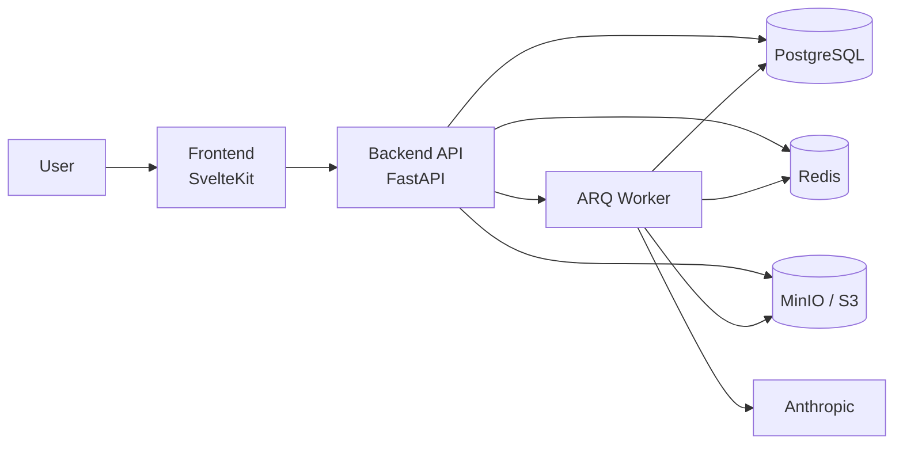

# HealthCabinet

HealthCabinet is a desktop-first personal health intelligence platform. Users upload lab reports or other health documents, the system extracts structured biomarker data, and the product turns that raw information into trend visibility and plain-language AI interpretation.

The project is built as a SvelteKit frontend plus a FastAPI backend, with Redis and an ARQ worker handling the asynchronous document-processing pipeline. Local development runs through Docker Compose.

## What Exists In This Repo

- Authentication, registration, and consent-aware account creation
- Medical onboarding and profile capture
- Document upload for PDFs and images, including partial extraction handling
- Biomarker dashboard with trend context and AI clinical notes
- Document cabinet with status streaming and detail views
- Admin operations surface for metrics and correction workflows
- Kubernetes manifests and GitOps-oriented infrastructure assets

## Stack

| Area | Technology |
| --- | --- |
| Frontend | SvelteKit 2, Svelte 5 runes, TypeScript, Tailwind CSS v4, 98.css, TanStack Query |
| Backend | FastAPI, SQLAlchemy 2.0 async, Alembic, PyJWT, Pydantic Settings |
| AI and jobs | Anthropic, LangGraph, LangChain adapters, ARQ, Redis |
| Storage | PostgreSQL 16, MinIO locally, S3-compatible object storage in production |
| Delivery | Docker Compose, Kubernetes, FluxCD, SOPS |

## System Shape



## Quick Start

### 1. Prerequisites

- Docker and Docker Compose
- Node.js `22.x`
- Python `3.12+`
- [`uv`](https://docs.astral.sh/uv/)

### 2. Configure environment files

```bash
cp backend/.env.example backend/.env
cp frontend/.env.example frontend/.env
```

Generate an encryption key and set `ENCRYPTION_KEY` in `backend/.env`:

```bash
python3 -c "import secrets,base64; print(base64.b64encode(secrets.token_bytes(32)).decode())"
```

Optional for local admin bootstrap:

```bash
# backend/.env
BOOTSTRAP_ADMIN_EMAIL=admin@example.com
BOOTSTRAP_ADMIN_PASSWORD=change-me
```

### 3. Start the local stack

```bash
docker compose up -d
```

The Compose stack includes:

- `frontend` on `http://localhost:3000`
- `backend` on `http://localhost:8000`
- `postgres` on `localhost:5432`
- `redis` on `localhost:6379`
- `minio` on `http://localhost:9000`
- `minio console` on `http://localhost:9001`
- `worker` for async processing

The backend is configured to run migrations automatically on startup in Compose. If you need to run them manually:

```bash
docker compose exec backend uv run alembic upgrade head
```

### 4. Verify the app

```bash
curl http://localhost:8000/health
```

Expected response:

```json
{"status":"ok"}
```

## Local Development

### Backend

```bash
cd backend
uv sync
uv run uvicorn app.main:app --reload --port 8000
```

### Frontend

```bash
cd frontend
npm install
npm run dev
```

### Quality Checks

Fast feedback:

```bash
cd backend
uv run ruff check .
uv run ruff format .
uv run mypy app/
uv run pytest
```

```bash
cd frontend
npm run check
npm run lint
npm run test:unit
npm run build
```

Compose-backed validation for integration-sensitive work:

```bash
docker compose exec backend uv run pytest
docker compose exec frontend npm run test:unit
cd frontend && npm run test:e2e
```

## Repository Layout

```text
healthcabinet/
├── backend/              FastAPI service, Alembic migrations, tests
├── frontend/             SvelteKit app and UI tests
├── k8s/                  Kubernetes manifests and overlays
├── docker-compose.yml    Local development stack
└── README.md             Application guide
```

## Product And Planning Docs

| Artifact | Location | Why it matters |
| --- | --- | --- |
| PRD | [`../_bmad-output/planning-artifacts/prd.md`](../_bmad-output/planning-artifacts/prd.md) | Product scope, users, success criteria, and roadmap |
| Architecture | [`../_bmad-output/planning-artifacts/architecture.md`](../_bmad-output/planning-artifacts/architecture.md) | Technical decisions, platform shape, and domain boundaries |
| UX design specification | [`../_bmad-output/planning-artifacts/ux-design-specification.md`](../_bmad-output/planning-artifacts/ux-design-specification.md) | Design system, UI principles, and accessibility rules |
| UX page specifications | [`../_bmad-output/planning-artifacts/ux-page-specifications.md`](../_bmad-output/planning-artifacts/ux-page-specifications.md) | Page-level implementation guidance |
| UX mockups | [`../_bmad-output/planning-artifacts/ux-page-mockups.html`](../_bmad-output/planning-artifacts/ux-page-mockups.html) | Visual reference for implemented and planned screens |
| Pitch deck | [`../_bmad-output/presentations/healthcabinet-pitch-deck.html`](../_bmad-output/presentations/healthcabinet-pitch-deck.html) | Designed presentation for demos, partners, or investor conversations |
| Pitch deck outline | [`../_bmad-output/presentations/healthcabinet-pitch-deck.md`](../_bmad-output/presentations/healthcabinet-pitch-deck.md) | Slide-by-slide script, speaker notes, and message framing |

## Presentation Assets

The presentation bundle lives in [`../_bmad-output/presentations/`](../_bmad-output/presentations/README.md):

- `healthcabinet-pitch-deck.html` for a browser-ready, styled deck
- `healthcabinet-pitch-deck.md` for the narrative outline and speaker notes

## Security And Data Handling

- Health data is intended to remain in AWS `eu-central-1`.
- User-facing health data is sensitive by design; do not commit populated `.env` files or secrets.
- Use the example env files as the source of truth for local setup.
- GDPR-oriented consent, export, and deletion workflows are part of the product scope.
